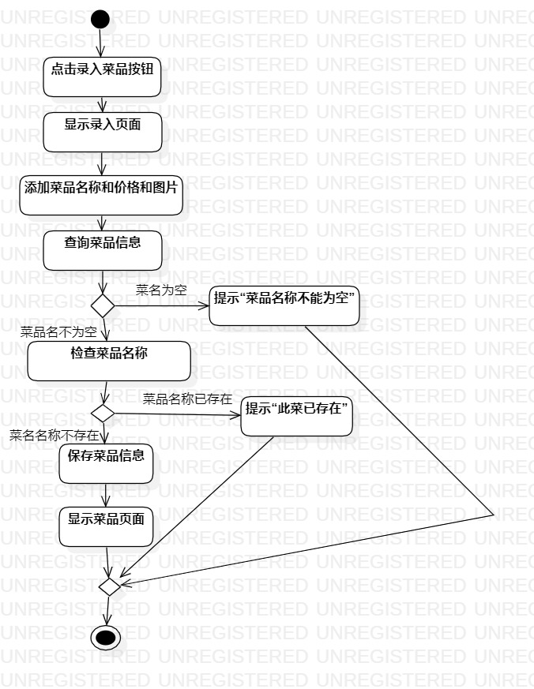
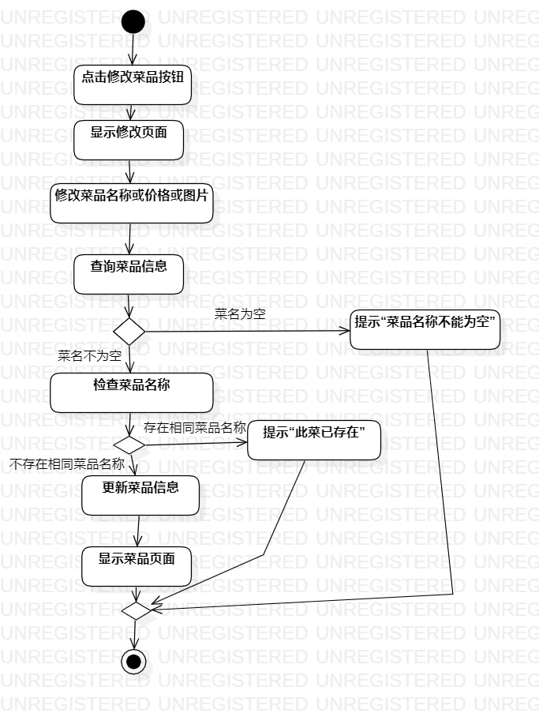
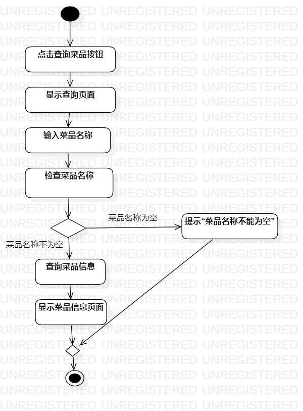

# 实验三：用例建模

### 一、实验目标
    1.掌握过程建模方法
    2.掌握活动图的画法
    

### 二、实验内容
    1.根据自己的用例规约画出相应的活动图。
    2.熟悉自己的扩展流程，掌握出现分支的操作，如何使用决策（Decision）节点。
       
 ### 三、实验步骤
     1.根据实验二的用例规约画出相应的活动图
     2.用例规约：1）录入菜品 2）修改菜品 3）查找菜品 画出活动图，如下图1，2，3所示
     3.用例规约的Initial点，Action图，决策点和Merge，Final，按流程画出来。
     4.理清需求，再次完善分支操作。如：录入菜品和修改菜品时检查到菜品名称为空，返回修改项继续修改。查找菜品时，菜品名称为空，返回输入菜品名称。
     5.填写好分支条件。
     6.按流程和需求逻辑，用Control Flow连接。
     
     

### 四、实验结果

  
  
  
  
  
  图1.录入菜品的活动图
  
  
  
  
  
  
  
  图2.修改菜品的活动图
  
  
  
   
   
   
   
  
  图3.查找菜品的活动图
  
