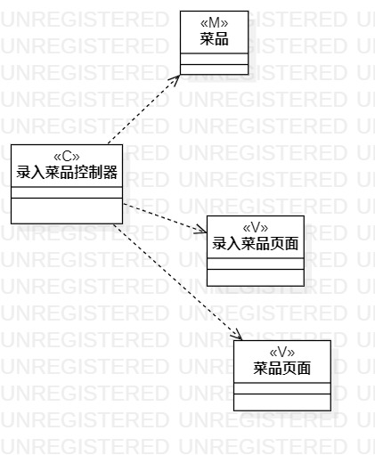
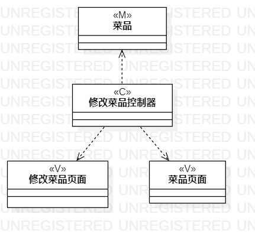
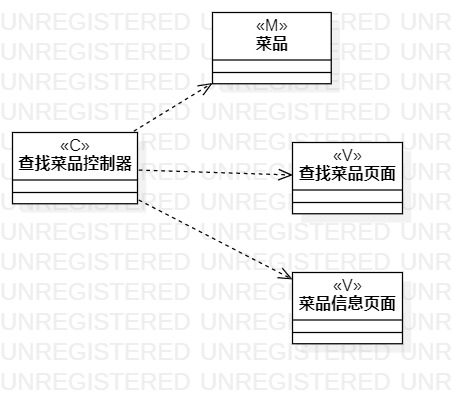

# 实验四：类建模
# 实验五：高级类建模

### 一、实验目标
   1. 掌握类建模方法
   2. 了解MVC或熟悉的设计模式
   3. 掌握类图的画法（Class Diagram）
   4. 理解类的5种关系
    

### 二、实验内容
    1.根据选题的用例规约的基本流程和扩展流程，找出必要的类，并创建类图。
    2.基于MVC设计模式，标出Model，View，Control，画出类图。
       
 ### 三、实验步骤
     1.根据实验二的用例规约画出相应的类图
     2.用例规约：1）录入菜品 2）修改菜品 3）查找菜品 画出类图，如下图1，2，3所示
     3.根据1）录入菜品，找到了录入菜品控制器，菜品，录入菜品页面。
           2）修改菜品，找到修改菜品控制器，菜品，修改菜品页面。
           3）查找菜品，找到查找菜品控制器，菜品，查找菜品页面。
     
     4.再将类之间的关系连起来。如：Dependency,Association,Aggregation,Composition，inheritance。
     
     
     

### 四、实验结果

  
  
  
  
  
  图1.录入菜品的类图
  
  
  
  
  
  
  
  图2.修改菜品的类图
  
  
  
   
   
   
   
  
  图3.查找菜品的类图
  
  
  ### 五、学习笔记
      1.设计模式MVC：Model指模型，View指试图，Control指控制器。
        Model一般指数据，View一般指界面，Control一般是封装了系统的操作。
      2.模型和视图之间是不能通信的，控制器可以对模型和试图发消息。
      3.由弱到强的关系排列：Dependency,Association,Aggregation,Composition，inheritance。把模型建到越弱的关系，使软件有更好的修改性。
      4.要弄清楚什么是类，什么是类的属性。如商品是一个类，商品名称不是类。
      5.不能有两个一样类，类可以自己包含自己。
      6.从需求里挖掘出必要的类。
  
  
  
