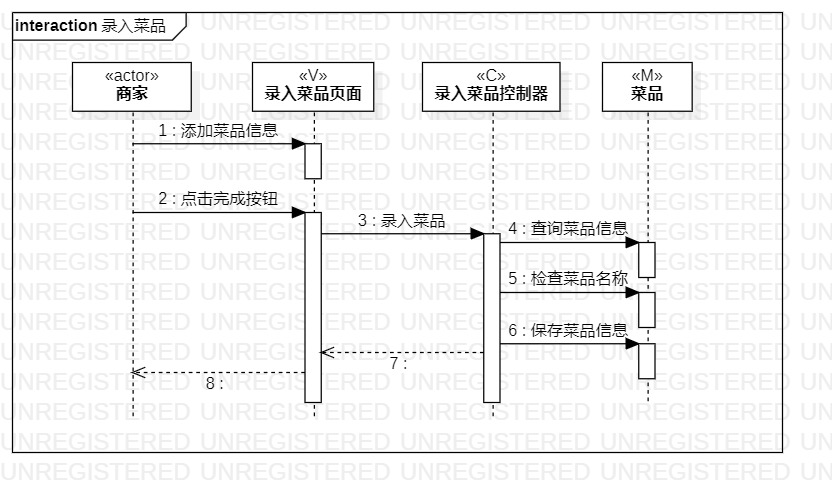
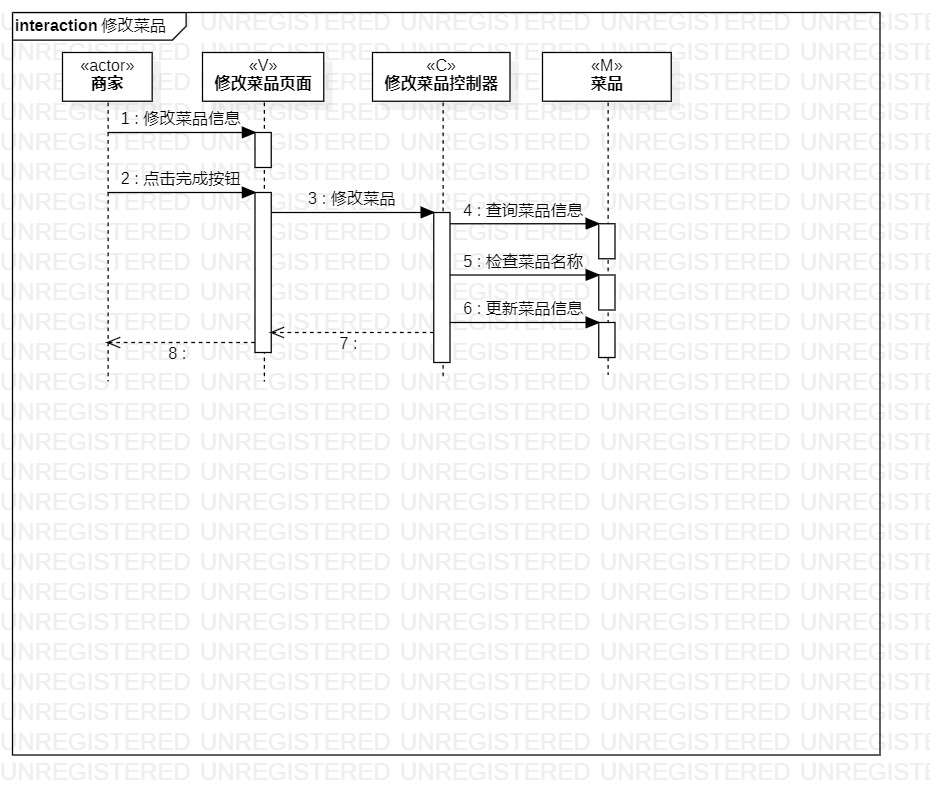
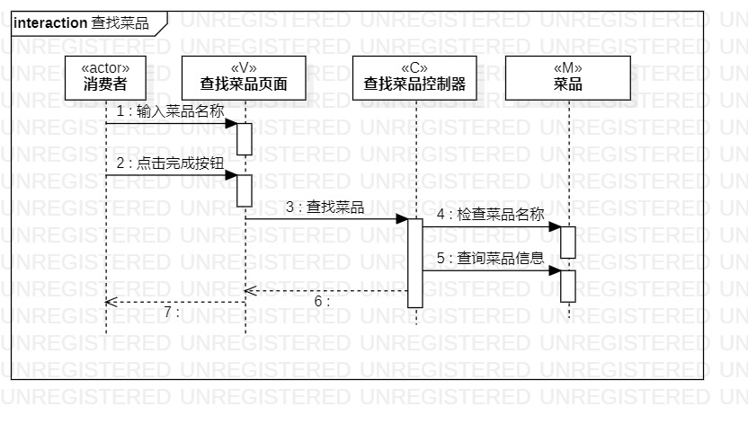

# 实验六：交互建模

### 一、实验目标
    1. 理解系统交互；
    2.掌握UML顺序图的画法；
    3.掌握对象交互的定义与建模方法。
    

### 二、实验内容
    1.根据选题的用例规约的基本流程和扩展流程，实验三的活动图，实验四实验五的类图画出相应的顺序图，并创建顺序图。

       
 ### 三、实验步骤
     1.根据实验三的活动图，实验四实验五的类图画出相应的顺序图，如下图1，2，3所示；
     2.从用例图找到第一个参与者（actor）；
     3.从类图找到N个参与者，顺序图应该有1+N个参与者；
     4.从活动图里找到操作步骤，画出参与者之间的消息。
     
     
     

### 四、实验结果

  
  
  
  
  
  图1.录入菜品的顺序图
  
  
  
  
  
  
  
  图2.修改菜品的顺序图
  
  
  
   
   
   
   
  
  图3.查找菜品的顺序图
