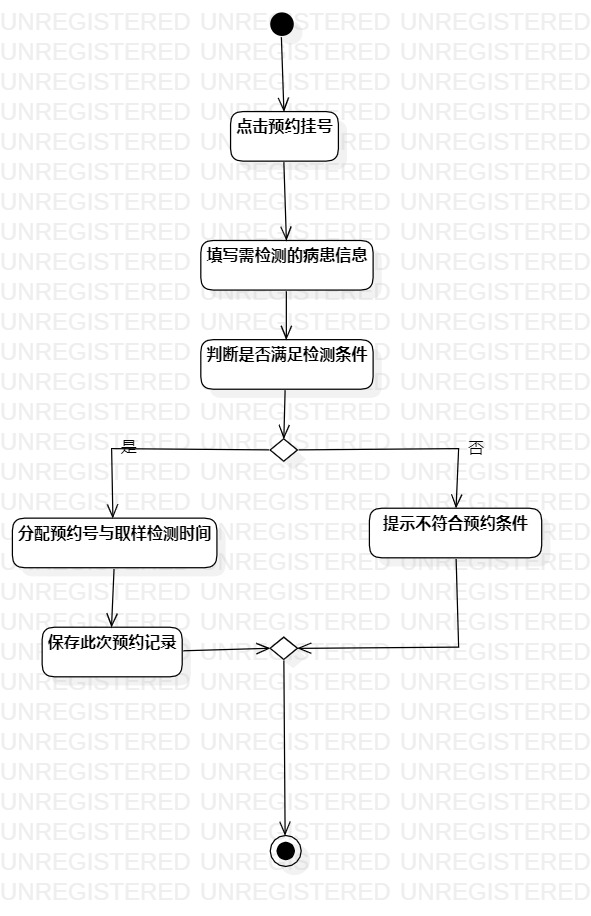
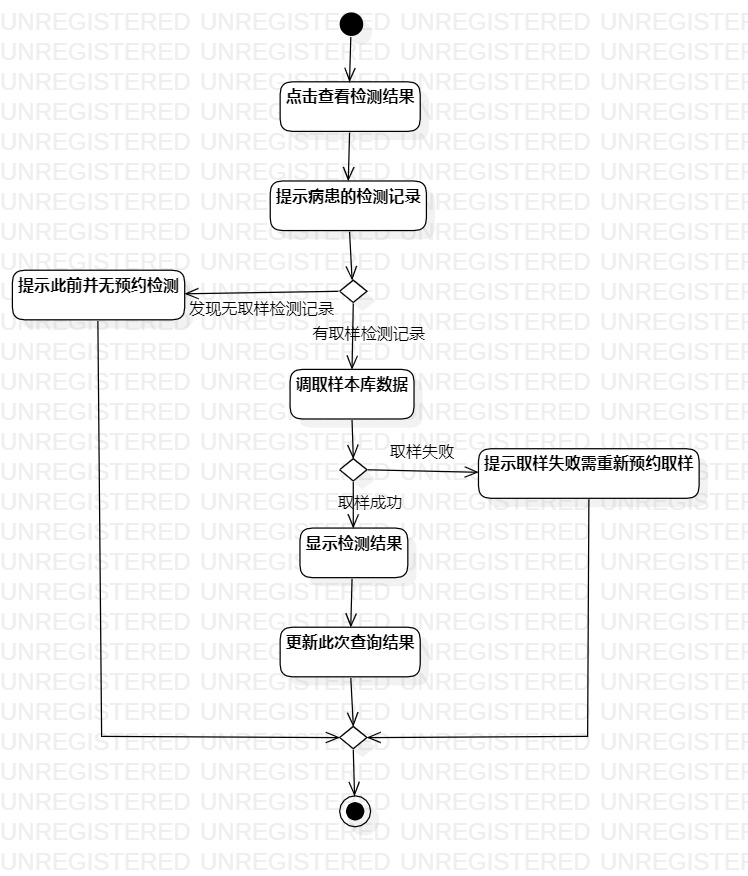

# 实验三：过程建模
## 一、实验目标
- 1.学习过程建模活动图的概念与构成
- 2.学习并掌握活动图画法
- 3.根据用例规约完成活动图
## 二、实验内容
- 1.完成活动图
- 2.完成实验报告

## 三、实验步骤
- 1.分别画出两个用例的活动图

## 四、实验结果
- 1.用例“预约挂号”的活动图  
  
图1 预约挂号的活动图

- 2.用例“查看检测结果”的活动图  
  
图2 查看检测结果的活动图
