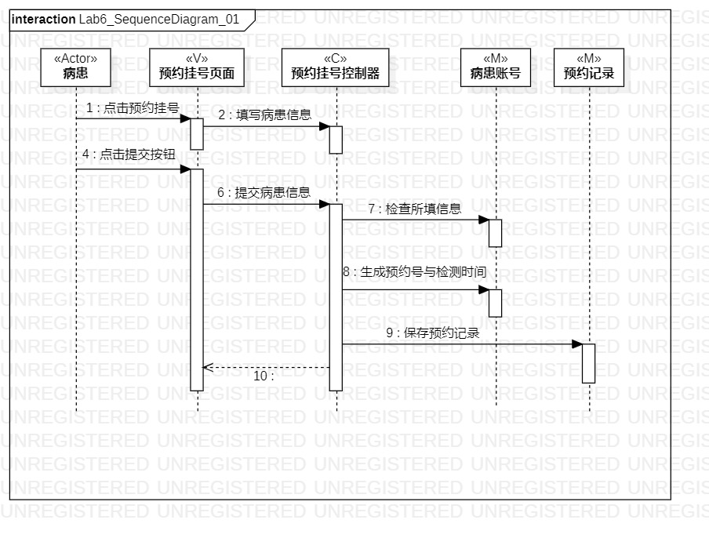
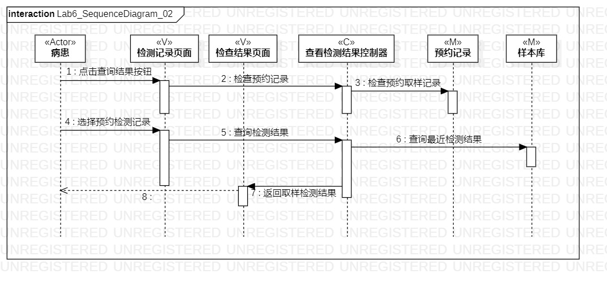

# 实验六：交互建模
## 一、实验目标
- 1.掌握交互建模所涉及概念
- 2.掌握交互的定义与画图方法

## 二、实验内容
- 1.确定功能所涉及的系统对象
- 2.在顺序图上画出参与者和消息
- 3.完成实验报告

## 三、实验步骤
- 1.根据用例图与类图画出对象
- 2.根据活动图画出消息

## 四、实验结果
- 1.顺序图01  
  
图1 第一个顺序图
- 2.顺序图02  
  
图2 第二个顺序图
