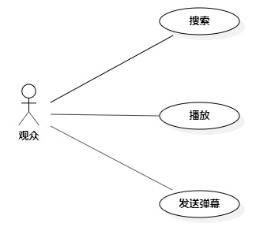

# 实验二：用例建模

## 1. 实验目标

- 确定实验题目
- 细化题目内容
- 学习画用例图

## 2. 实验内容

- 创建用例图
- 编写用例规约
- 编写实验文档

## 3. 实验步骤

- 提交"cilicili弹幕视频平台"选题Issue
- 新建Use Case Diagram
- 确定Actor(观众)
- 确定UseCase(搜索、播放、发送弹幕）
- 确定Actor与UseCase的关系
- 编写用例规约

## 4. 实验结果

  
图1.cilicili弹幕视频平台用例图

## 表1：搜索用例规约  

用例编号  | UC01 | 备注  
-|:-|-  
用例名称  | 搜索  |   
前置条件  |      | *可选*   
后置条件  |      | *可选*   
基本流程  | 1. 观众点击搜索框；  |*用例执行成功的步骤*    
~| 2. 观众输入搜索内容；  |   
~| 3. 系统检查搜索内容不为空，查询视频标题； |   
~| 4. 系统显示视频列表页面；  |   
扩展流程  | 3.1 系统检查搜索内容为空，提示“搜索内容不能为空”；  |*用例执行失败*    
~| 3.2 系统无法识别搜索内容，提示“请重新输入”。  |  

## 表2：播放用例规约  

用例编号  | UC02 | 备注  
-|:-|-  
用例名称  | 播放  |   
前置条件  | 观众进入视频播放页面     | *可选*   
后置条件  |      | *可选*   
基本流程  | 1. 观众点击播放视频按钮；  |*用例执行成功的步骤*    
~| 2. 系统检查视频来源于本站，同步弹幕到本地弹幕池；  |   
~| 3. 系统装载弹幕到视频中；  |   
~| 4. 系统启用弹幕视频播放器，播放视频与滚动弹幕；  |     
扩展流程  | 2.1 系统检查视频来源于外站，直接调用外站的视频播放器。   |*用例执行失败*    

## 表3：发送弹幕用例规约  

用例编号  | UC03 | 备注  
-|:-|-  
用例名称  | 发送弹幕  |   
前置条件  | 观众已登录且进入了视频播放页面     | *可选*   
后置条件  |      | *可选*   
基本流程  | 1. 观众点击发送弹幕框；  |*用例执行成功的步骤*    
~| 2. 观众输入要发送的弹幕内容；  |   
~| 3. 系统检测弹幕内容不为空；  |   
~| 4. 系统检测弹幕内容符合法律法规；  |   
~| 5. 系统保存弹幕到本地弹幕池；  |    
~| 6. 系统发送弹幕到云端弹幕池；  |  
~| 7. 系统滚动新弹幕到视频中；  |  
扩展流程  | 3.1 系统检测弹幕内容为空，提示“不能发送空弹幕”； |*用例执行失败*   
| 4.1 系统检测弹幕内容违反法律法规，提示“弹幕内容违反相关法律法规，请重新输入”。  |
