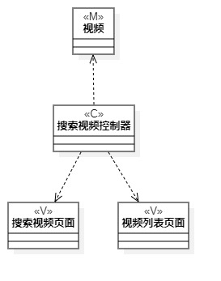
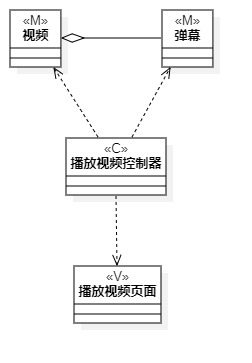
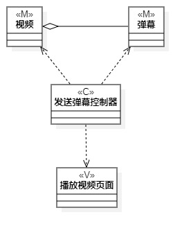

# 实验四:类建模
# 实验五:高级类建模

## 一、实验目标
- 了解类的概念
- 了解MVC设计模式
- 掌握类图画法
## 二、实验内容
- 根据用例规约绘制相应的类图。

   1. 搜索类图

   2. 播放类图

   3. 发送弹幕类图
## 三、实验步骤
- 在StarUML中创建类图
- 依据Lab2的用例规约寻找类
- 使用MVC设计模式确定类的关系
- 重新分析需求以找到真正的类
## 四、实验结果

图1 搜索类图

图2 播放类图

图3 发送弹幕类图
