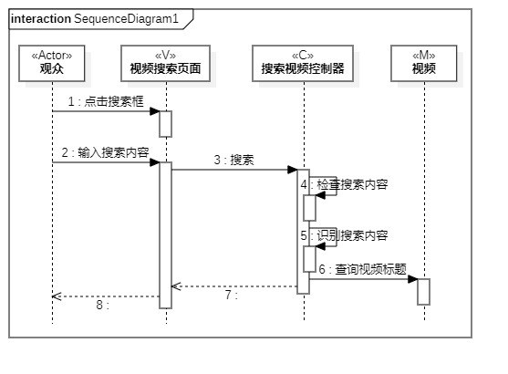
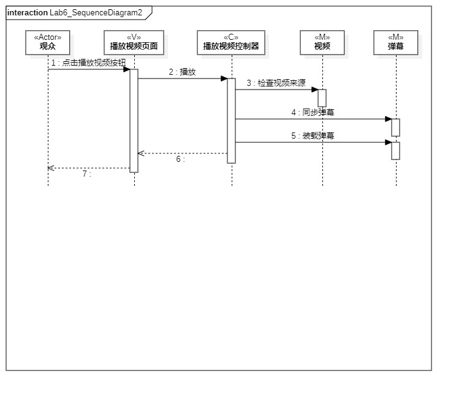
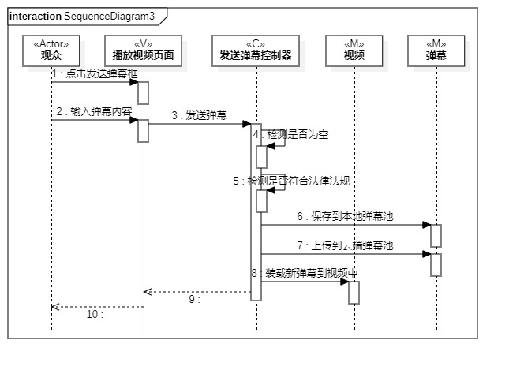

# 实验六：交互建模

## 1.实验目标
1. 理解系统交互；
2. 掌握UML顺序图的画法；
3. 掌握对象交互的定义与建模方法。

## 2. 实验内容
1. 根据用例模型和类模型，确定功能所涉及的系统对象；
2. 在顺序图上画出参与者（对象）；
3. 在顺序图上画出消息（交互）；

## 3. 实验步骤
1. 了解对象的定义；
2. 了解顺序图的构成、“时间顺序”的概念；
3. 了解对象交互的概念；
4. 了解存活条的概念；
5. 了解不同箭头的含义；
6. 从类图中找到对象：
   #### （1） 搜索
   观众（Actor）、视频列表页面（V）、搜索视频页面（V）、搜索视频控制器（C）、视频（M）；
   #### （2） 播放
   观众（Actor）、播放视频页面（V）、播放视频控制器（C）、视频（M）、弹幕（M）；
   #### （3） 发送弹幕
   观众（Actor）、播放视频页面（V）、发送弹幕页面（V）、发送弹幕控制器（C）、视频（M）、弹幕（M）；

7. 从活动图中提取出步骤；
8. 明确各个步骤涉及的对象。

## 4. 实验结果

  
图1：搜索的顺序图

  
图2：播放的顺序图

  
图3：发送弹幕的顺序图
