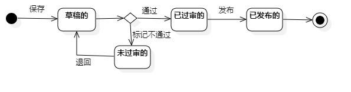

# 实验七：状态建模  

## 一、实验目标  

1. 掌握对象状态建模（状态图，Statechart)  

## 二、实验内容  

1. 寻找一个关键对象  
2. 设计该对象的关键状态  
3. 设计状态之间的转变条件  

## 三、实验步骤  

1. 寻找关键对象
- 弹幕  
2. 设计该对象的状态
- 草稿的  
- 已过审的  
- 未过审的  
- 已发布的  
3. 设计状态之间的转变条件  

## 实验结果 

  
图1：弹幕的状态图  
