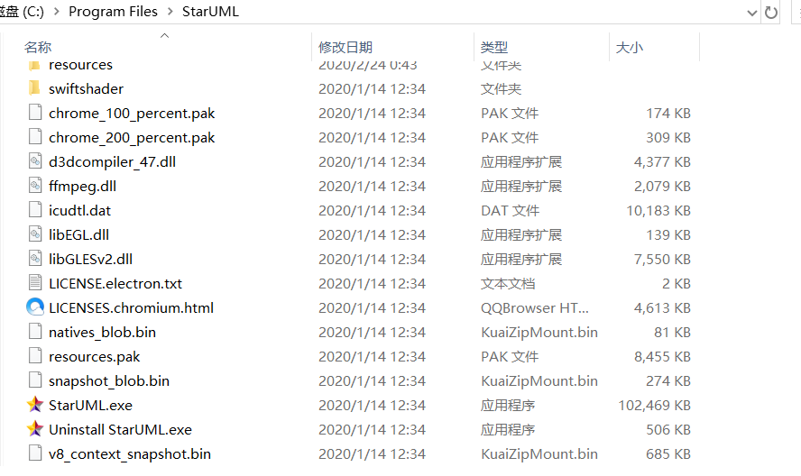

# 实验一

## 实验目标

# 下载StarUML和Git

# 注册git账号

# 确认选题及其功能要求

# 使用git上传本地使用文件

# 在GitHup将git上的文件发送至老师账号

## 实验内容

## 选题标题：音乐播放器
# 数据库的建立 歌曲（ID，歌曲名字，歌手）， 播放列表（歌曲序号，歌曲名字）

## 功能需求
# 功能1：播放音乐
# 功能2：从曲库中搜索歌曲
# 功能3：添加歌曲入库
