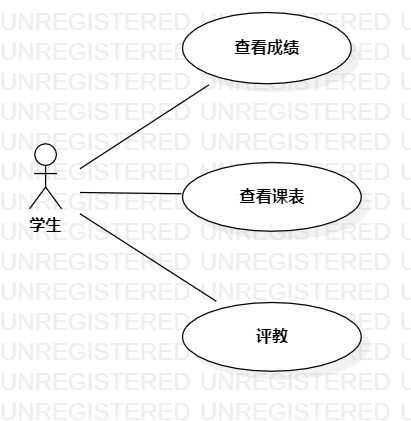

# 实验二(用例建模)

### 一、实验目标
    1. 熟悉github操作  
    2. 创建并完善选题  
    3. 熟悉StarUML  
    4. 了解并掌握用例图的画法  

### 二、实验内容
    1. 确定选题，并分析其功能性需求（2~3个）；
    2. 使用StartUML软件绘制用例建模图；
    3. 将用例建模图导出，并添加到实验报告中；
    4. 使用MarkDown编写实验报告，并提交到实验网站上。

### 三、实验步骤
    1. 确定选题：学生教务系统  
    2. 确定用户：学生  
    3. 确定功能：  
        - 查课表：学生可以查询本学期一周的课程安排  
        - 查成绩：学生可以查询本学期考试科目的成绩 
        - 评教：学生可以添加对任课老师的教学质量评估
    4. 在issues上提交以上选题与相关功能
    5. 选题通过后，用StarUML画用例图
        - 创建参与者“学生”
        - 创建“查课表”，“查成绩”，“评教”三个用例
        - 建立关系Association
        - 将例图保存为jpg格式  
    6. 提交用例图到github  
    7. 在guihub上编写第二次实验文档(包括用例规约)并提交  

### 四、实验结果
  
图1：“学生教务系统”用例图

## 表1：查课表用例规约

用例编号  | UC01 | 查课表  
-|:-|-  
用例名称  | 查课表  |   
前置条件  | 学生登录进入教务系统     |*可选*  
后置条件  |      |*可选*   
基本流程  | 1. 学生点击查课表选项；  |*用例执行成功的步骤*  
~| 2. 系统显示课表查询页面；  |  
~| 3. 学生选择学年学期并点击检索按钮；| 
~| 4. 系统检查时间无误，查询课表信息； |
~| 5. 系统显示课表信息。 |
扩展流程  | 4.1 系统检查时间有误，则提示“重新选择学年学期”    |*用例执行失败*
 

## 表2：查成绩用例规约

用例编号  | UC02 | 查成绩  
-|:-|-  
用例名称  | 查成绩  |   
前置条件  | 学生登录进入教务系统     |*可选*  
后置条件  |      |*可选*   
基本流程  | 1. 学生点击查成绩选项；  |*用例执行成功的步骤*  
~| 2. 系统显示成绩查询页面；| 
~| 3. 学生选择学年学期并点击检索按钮；  |   
~| 4. 系统检查时间无误，查询成绩信息；  | 
~| 5. 系统显示成绩信息。 |
扩展流程  | 4.1 系统检查时间有误，则提示“重新选择学年学期”    |*用例执行失败*     

## 表3：评教用例规约

用例编号  | UC03 | 评教  
-|:-|-  
用例名称  | 评教  |   
前置条件  | 学生登录进入教务系统     |*可选*  
后置条件  |      |*可选*   
基本流程  | 1. 学生点击评教选项；  |*用例执行成功的步骤*  
~| 2. 系统显示教学质量评估页面；  |   
~| 3. 学生选择任课老师，输入评教内容，点击提交按钮； | 
~| 4. 系统检查任课教师和评教内容都不为空，保存任课教师信息和评教内容信息； | 
~| 5. 系统显示评教成功页面。 |
扩展流程  | 4.1 系统检查任课教师或评教内容为空，提示学生输入。 |*用例执行失败* 

