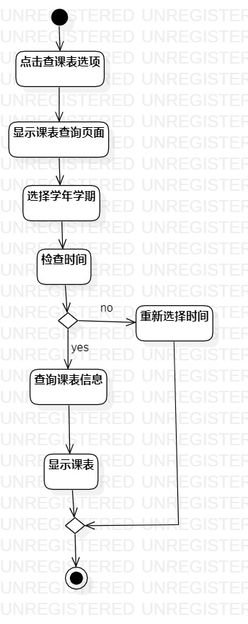
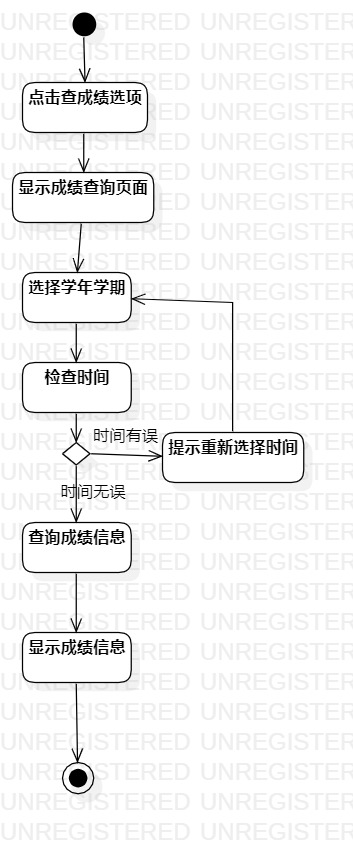
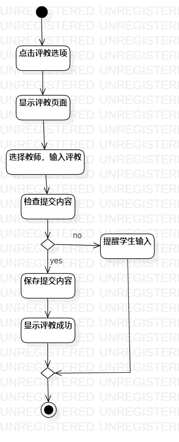

# 实验三 （过程建模）

### 一、实验目标

    1. 掌握过程建模方法

    2. 掌握活动图的画法

### 二、实验内容

    1. 阅读实验文档以及观看实验相关视频

    2. 根据实验二用例规约用StarUML画活动图

    3. 编写实验报告

### 三、实验步骤

    1. 打开实验2编写的用例规约  

    2. 在StarUML中创建3个活动图 （查询课表的活动图，查询成绩的活动图，教学评估的活动图）

      （1）创建起始节点和结束节点  

      （2）根据食品录入信息用例规约，添加活动及决策点  

      （3）建立各个节点、决策点和活动的关系  

    3. 编写实验报告 

### 四、实验结果

图1：查询课表的活动图

图2：查询成绩的活动图

图3：教学评估的活动图
