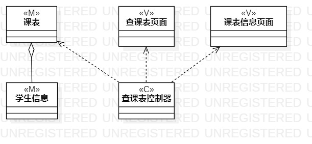
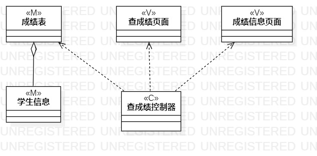

# 实验四:类建模

# 实验五:高级类建模

### 一、实验目标

      - 掌握类的概念和构成

      - 掌握类建模方法

      - 了解MVC设计模式

      - 理解类的5种关系

      - 掌握类之间关系的画法

### 二、实验内容

      - 根据用例规约绘制相应的类图。

       1.查询课表类图

       2.查询成绩类图

       3.教学评估类图

### 三、实验步骤

      - 在StarUML中创建类图

      - 从用例规约中的基本流程和扩展流程中寻找类

      - 根据系统操作设计业务服务类

      - 根据MVC设计模式确定类的关系

## 四、实验结果

图1 查询课表类图

图2 查询成绩类图

图3 教学评价类图
