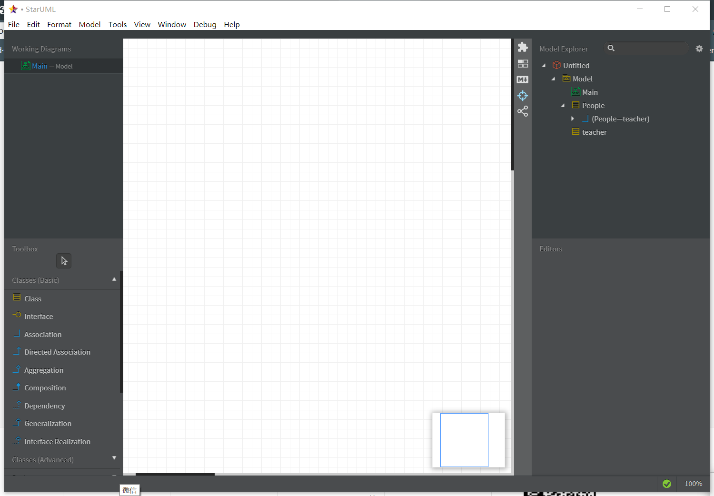

#实验一

##实验目标

#下载StarUML和Git

#注册git账号

#确认选题及其功能要求

#建立第一个UML模型图

#使用git上传本地使用文件

#在GitHup将git上的文件发送至老师账号

##实验内容

##选题标题：学生宿舍管理系统

##功能需求

#题目数据库建立，包括字符串型的宿舍号、学生的基本情况、报修内容

#功能1：查看电费

#功能2：查看宿舍人员情况

#功能3：报修申请