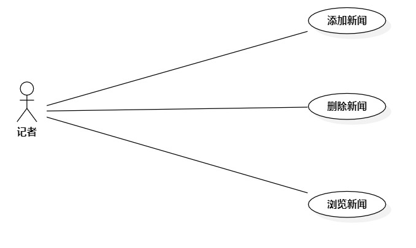

# 实验二 用例图

## 一、实验目标

1.选题，并画出用例图  
2.编写用例规约

## 二、实验内容

1. 确定个人建模选题，将选题填写在 Issues 中：  
https://github.com/hzuapps/uml-modeling-2020/issues  
2. 画出用例图（Use Case Diagram）  
3. 编写实验报告

## 三、实验步骤z

1.打开StarUML软件，在Model中添加一个Use Case Diagram  
2.添加三个用例，分别为添加新闻、删除新闻  
3.添加使用者，将使用者和用例链接起来  
4.将画出的用例图保存到students/1714080902502下  

## 四、实验结果

1.  
  
图一.新闻管理系统用例图

2.用例规约
## 表1：添加新闻用例规约  

用例编号  | UC01 | 备注  
-|:-|-  
用例名称  | 添加新闻  |   
前置条件  |      | *可选*   
后置条件  | 系统回到首页     | *可选*   
基本流程  | 1.新闻编辑点击添加链接；  |*用例执行成功的步骤*    
~| 2.系统显示添加新闻页面；  |   
~| 3.新闻编辑输入新闻标题和内容，点击添加按钮；   |   
~| 4.系统查询新闻标题及新闻内容，检查新闻未被添加；   |   
~| 5.系统获取新闻编辑的名字；   |  
~| 6.系统保存新闻，提示保存成功，返回首页。   |  
扩展流程  | 4.1 系统查询发现新闻已经存在，系统返回添加页面，提示添加失败  |*用例执行失败*    
~| 4.2 系统查询发现新闻标题和内容为空，系统返回添加页面，提示新闻标题和内容不能为空  |

## 表2：删除新闻用例规约  

用例编号  | UC02 | 备注  
-|:-|-  
用例名称  | 删除新闻  |   
前置条件  |      | *可选*   
后置条件  | 系统回到首页     | *可选*   
基本流程  | 1.新闻编辑点击删除链接；  |*用例执行成功的步骤*    
~| 2.系统显示删除新闻页面；  |   
~| 3.新闻编辑输入新闻标题，点击删除按钮；   |   
~| 4.系统查询新闻标题，检查新闻已存在；   |   
~| 5.系统获取新闻编辑的名字；   |  
~| 6.系统提示删除成功，返回首页。   |  
扩展流程  | 4.1 系统查询发现新闻标题不存在，即新闻不存在，系统返回删除页面，提示删除失败  |*用例执行失败*    
~| 4.2 系统查询发现新闻标题为空，系统返回删除页面，提示新闻标题不能为空  |
