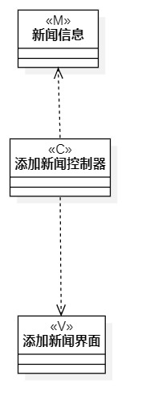
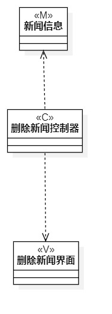

# 实验四 类建模
# 实验五 高级类建模

## 一、实验目标

1. 掌握类的概念和构成  
2. 掌握类建模方法  
3. 了解MVC设计模式  
4. 理解类的五种关系  
5. 掌握类之间关系的画法  

## 二、实验内容

1. 基于MVC模式设计类；
2. 设计类的关系；
3. 画出类图。 

## 三、实验步骤

1. 在 StartUML 中创建类图：AddMVC、DeleteMVC  
2. 从用例规约中找出必要的类  
3. 创建相关类
4. 根据各个类之间的关系，用线将它们连接起来  

## 四、实验结果

  
图一.添加新闻类图

  
图一.删除新闻类图

