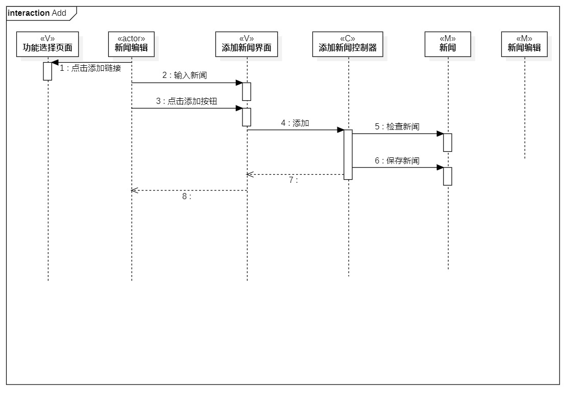
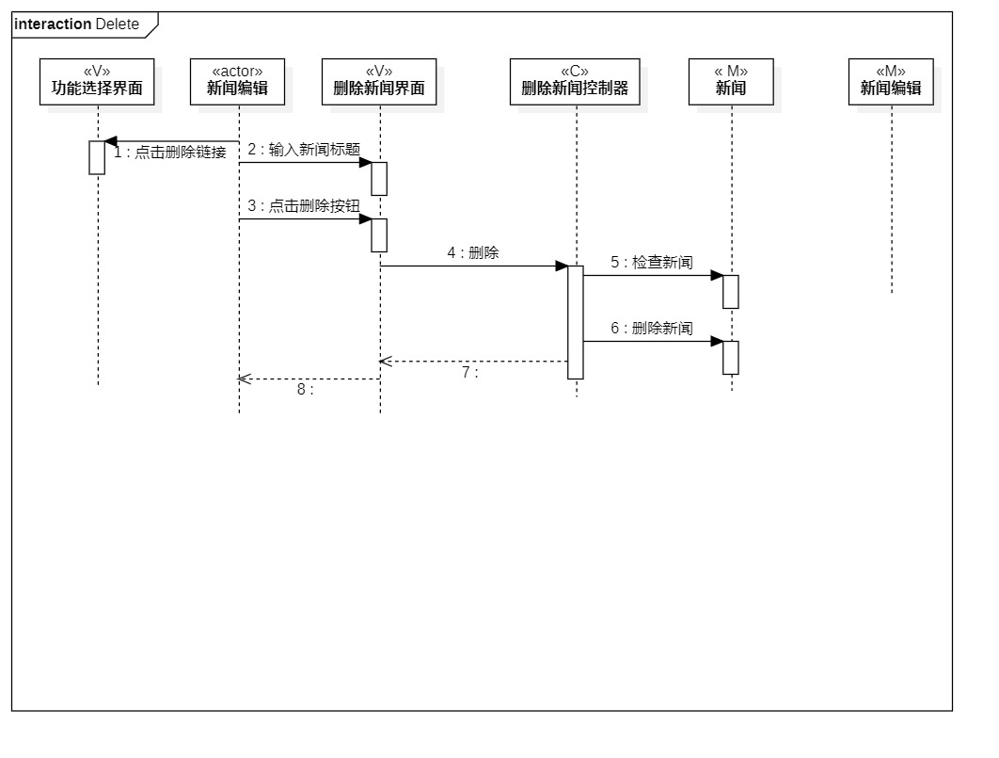

# 实验六 交互建模

## 一、实验目标

1. 理解系统交互；
2. 掌握UML顺序图的画法；
3. 掌握对象交互的定义与建模方法。

## 二、实验内容

1. 根据用例模型和类模型，确定功能所涉及的系统对象；
2. 在顺序图上画出参与者（对象）；
3. 在顺序图上画出消息（交互）。 

## 三、实验步骤

1. 从用例规约、用例图和类图中找出所有的系统对象  
2. 用 Lifeline 画出所有的对象  
3. 根据活动图，按顺序画出对象间所有的 Message
4. 在需要返回消息的对象之间建立 Reply Message  

## 四、实验结果

  
图一.添加顺序图

  
图二.删除顺序图

