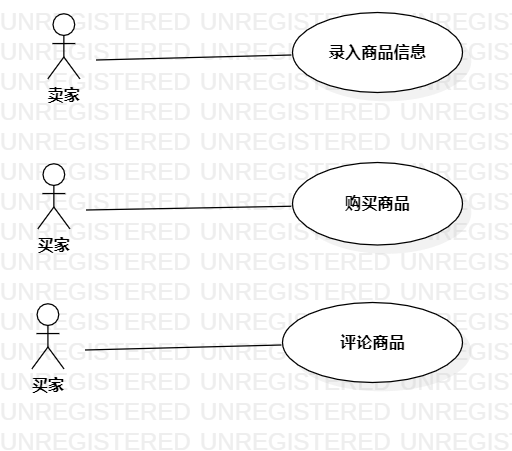

# 实验二

## 一、实验目标

&emsp;学习掌握用例建模知识

## 二、实验内容

1. UML建模选题
2. 绘制用例图
3. 编写用例规约

## 三、实验步骤

1. 建模选题为二手交易网站，确定功能需求
2. 根据选题功能绘制用例图
3. 确定用例：录入商品信息，购买商品，留言商品
4. 确定参与者：卖家，买家
5. 联系参与者和用例
6. 编写用例规约

## 四、实验结果

图1.二手交易平台用例图

## 表1：录入商品信息用例规约  

用例编号  | UC01 | 备注  
-|:-|-  
用例名称  | 录入商品信息  |   
前置条件  |卖家登录二手交易网站      |  
后置条件  |卖家进入对应商品类别的商品列表     |   
基本流程  | 1. 卖家进入个人中心页面  | 
~| 2. 系统显示个人中心页面  |   
~| 3. 卖家在个人中心页面点击出售按钮  |   
~| 4. 系统显示信息录入页面  |   
~| 5. 卖家输入商品信息后点击提交按钮 |  
~| 6. 系统检查必填信息填写完全，保存商品信息 |
~| 7. 系统根据添加时间顺序显示对应商品类别的商品列表 |
扩展流程  | 4. 系统检查卖家在卖家黑名单内，提示"您的账号被封禁，无法出售物品" |    
~| 6. 系统检查商品必填信息为空,提示"信息未填写完全"   |  

## 表2：购买商品用例规约  

用例编号  | UC02 | 备注  
-|:-|-  
用例名称  | 购买商品  |   
前置条件  | 买家登录二手交易网站   |
后置条件  | 系统显示订单完成页面   |   
基本流程  | 1. 买家在商品详情页点击购买按钮   |  
~| 2. 系统显示订单支付页面 |   
~| 3. 系统查询并显示用户保存的收货信息  |   
~| 4. 买家检查或修改订单信息后点击支付按钮 |    
~| 5. 系统保存订单信息 |
~| 6. 系统调用第三方支付接口，显示第三方支付窗口 |
~| 7. 买家在第三方支付窗口完成支付 |
~| 8. 系统查询返回结果为支付成功，保存支付状态|
~| 9. 系统显示订单完成页面  |
扩展流程  | 2. 系统检查买家未登录，提示"您未登录, 无法购买"   |  
~| 5. 系统检查收货信息不完整，提示"收货信息未填写完全"  | 
~| 8.1 系统查询返回结果为支付失败，显示订单未支付页面 |

## 表3：留言商品用例规约  

用例编号  | UC03 | 备注  
-|:-|-  
用例名称  | 留言商品  |   
前置条件  | 买家登录二手交易网站   |
后置条件  | 保存留言，增加商品留言数   |   
基本流程  | 1. 买家在商品详情页点击留言按钮   |  
~| 2. 系统显示留言列表和文本输入框 |   
~| 3. 买家输入留言点击发送按钮  |   
~| 4. 系统保存留言，增加该商品的留言数 |    
扩展流程  | 3.1 系统检测买家未登录，提示"您未登录,无法留言" |  
~| 3.2 系统检测留言商品下架，提示"商品已下架" |
