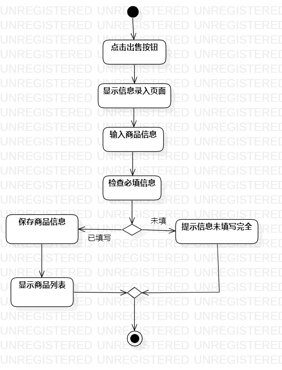
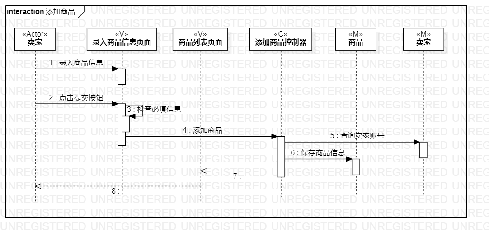
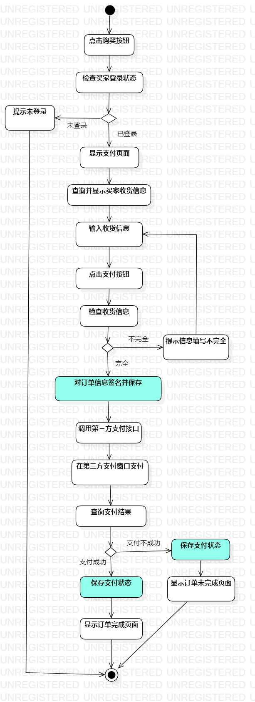
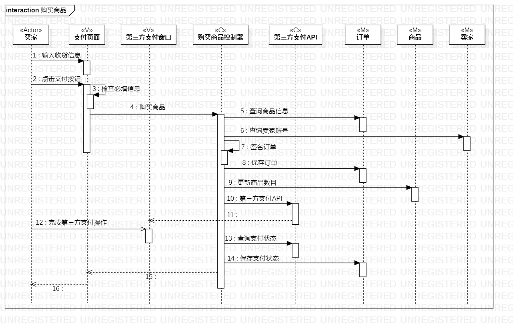
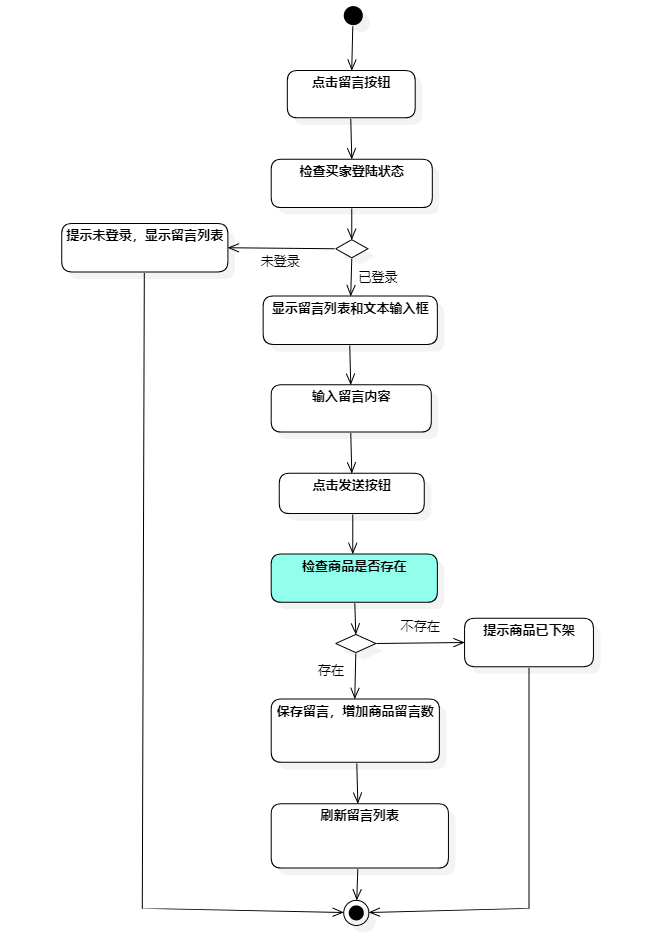
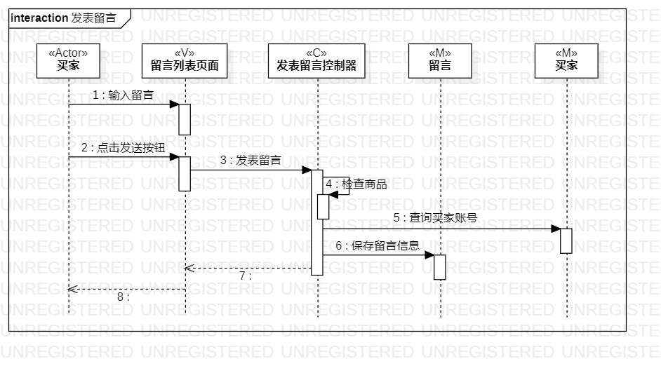

# 实验六

## 一、实验目标

1. 理解系统交互；
2. 掌握UML顺序图的画法；
3. 掌握对象交互的定义与建模方法。

## 二、实验内容

1. 根据用例模型和类模型，确定功能所涉及的系统对象；
2. 在顺序图上画出参与者（对象）；
3. 在顺序图上画出消息（交互）。

## 三、实验步骤

1. 根据用例模型的参与者和类模型设计的类确定顺序图的参与者，在UML中以Lifeline表示
2. 根据活动图的操作确定参与者之间的消息
3. 完善之前的模型

## 四、实验结果
  
图1.添加商品活动图

  
图2.添加商品顺序图

  
图3.购买商品活动图

  
图4.购买商品顺序图

  
图5.发表留言活动图

  
图6.发表留言顺序图
