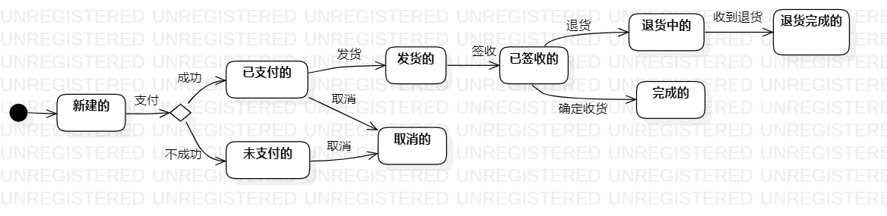

# 实验七

## 一、实验目标

&ensp;&ensp;掌握对象状态建模（状态图，Statechart）

## 二、实验内容

&ensp;&ensp;选择所建模软件系统一个最重要的对象进行状态建模，不局限于所选的功能。

## 三、实验步骤

1. 寻找一个系统中重要的对象，这里我选择订单
2. 在UML中用initial state和final state绘制起点和终点
3. 确定对象在系统实现过程中出现的不同状态，在UML中用simple state表示
4. 确定触发状态转变的事件

## 四、实验结果
  
图1.订单状态图
