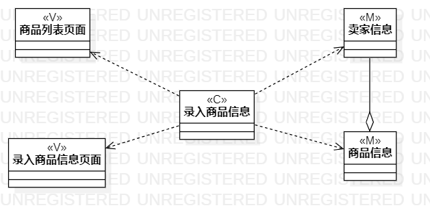
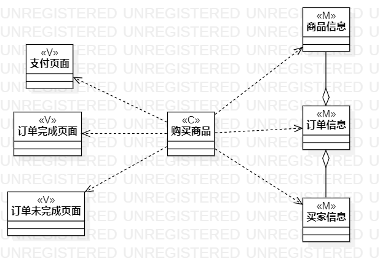
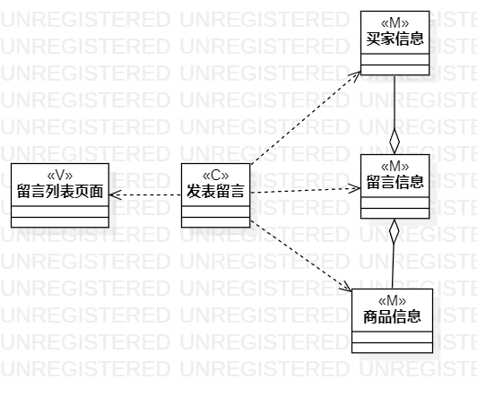

# 实验四五

## 一、实验目标

1. 掌握类建模方法；
2. 了解MVC或你熟悉的设计模式；
3. 掌握类图的画法。（Class Diagram）

## 二、实验内容

1. 基于MVC模式设计类；
2. 设计类的关系；
3. 画出类图

## 三、实验步骤

1. 确定设计模式，这里我选择MVC模式
2. 绘制类图  
    * 确定模型层(Model)：根据用例涉及的数据设计模型类  
    * 确定控制器层(Controller)：根据用例中实现界面与数据层之间交互的方法设计控制器类 
    * 确定视图层(View)：根据用例中使用到的界面设计界面类  
    * 确定类之间关系 
3. 检查类图及类之间的关系，确定以模型中的类能实现用例功能。

## 四、实验结果
  
图1.录入商品信息类图

   
图2.购买商品类图

  
图3.发表留言类图

## 五、实验总结
&emsp;&emsp;此次实验课的内容是类建模，类建模处在系统4+1视图的逻辑视图层面，它界定了由哪些类实现用例，所以本次实验也是要基于用例建模的内容。类由属性和操作组成，可以作为实体的抽象，是实现面向对象设计的重要手段。由类可以创建对象，使用类中的方法来改变属性。在UML中，类由矩形表示，矩形中可说明类名，属性和操作。类之间的关系有5种，从弱到强依次是依赖、关联、聚合、组成、继承。类之间的关系弱有利软件的修改和测试。在软件系统开发中，有一些实践经验可供我们参考和使用，称之为设计模式。对于MVC模式，它把软件系统分别分成模型层，视图层和控制层。模型层负责软件系统的数据和实体，视图层负责软件的界面，控制层是模型层和视图层之间的桥梁，实现它们之间的交互。
