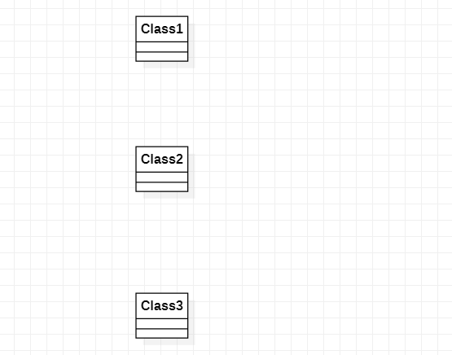

# 实验一

## 实验内容
  熟悉在github提交实验

## 实验步骤
### 1. 注册github账号
### 2. 将实验仓库fork到自己账号中
### 3. 使用git将自己账号的实验仓库克隆到本地
所需命令：
切换操作路径 cd
克隆仓库到本地 git clone
### 4. 在仓库中进行添加文件或修改操作
### 5. 提交文件到被克隆的远程仓库中
a. git add
b. git commit -m
c. git push
### 6. 确定最后修改后发送合并请求
检查与主项目库的不同是否符合自己预料

