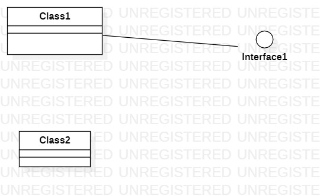

# 实验1 UML建模工具
## 一、实验目标
1. 安装并熟悉使用UML建模工具；
2. 学习使用GitHub进行实验；

## 二、实验内容
1. 下载并安装git；
2. 练习使用git进行实验；
3. 下载并安装建模工具StarUML；
4. 练习使用StarUML。

## 三、实验步骤
1. 下载并安装建模工具及实验工具；
2. 加入GitHub实验库；
3. 用starUML画图；
4. 确定建模主题，选择两个功能进行建模；
5. 编写实验报告。

## 四、个人选题
### 选题：
家教中介系统
### 功能：
1. 家教上传简历
2. 家长发布家教信息

## 五、实验结果

starUML截图  

UML图  

