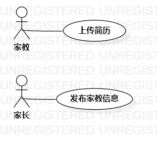

# 实验2 用例建模
## 一、实验目标
1. 理解用例的概念；
2. 掌握用例图的画法；
3. 学习用例规约的写法。

## 二、实验内容
1. 分析选题，将功能细化；
2. 分析功能编写用例规约；
3. 画出用例图。  

## 三、实验步骤
1. 分析选题和功能；
2. 编写用例规约；
3. 画用例图；
4. 编写实验报告；  

## 四、实验结果

用staruml画家教中介系统用例图  

## 五、用例规约
### 表1：家教中介系统用例规约

用例编号  | UC01 | 备注
-|:-|-
用例名称  | 上传简历  |
前置条件  |   家教登录   | *可选*
后置条件  |              | *可选*
基本流程  | 1. 家教点击我要做家教  |*用例执行成功的步骤*
~| 2. 系统显示上传页面  |   
~| 3. 家教输入简历，上传个人照片，点击保存简历  |   
~| 4. 系统检查简历必填内容，系统保存简历。   |   
~| 5. 系统提示“上传成功”。   |  
扩展流程  | 4.1简历未填写完整   |*用例执行失败*    
~|4.2未上传照片或不是人像图片   |  

用例编号  | UC02 | 备注  
-|:-|-  
用例名称  | 发布家教信息  |   
前置条件  |   家长登录   | *可选*   
后置条件  |              | *可选*   
基本流程  | 1. 家长点击我要找家教； |*用例执行成功的步骤*
~| 2. 系统显示家教发布页面；  |   
~| 3. 家长填写家教信息，选择家教需求，点击发布家教；   |
~| 4. 系统检查家教信息和家教需求，系统保存家教信息 |   
~| 5. 系统提示“发布成功”   |  
扩展流程  |4.1 家教信息未填写完整   |*用例执行失败*   
~| 4.2 没有符合需求的家教   |  