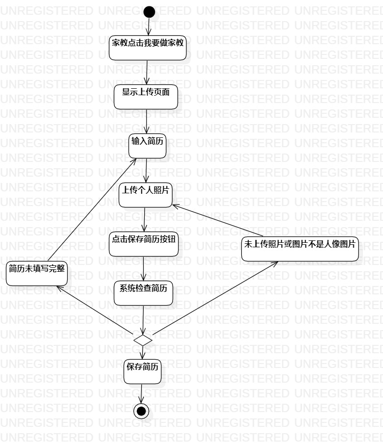
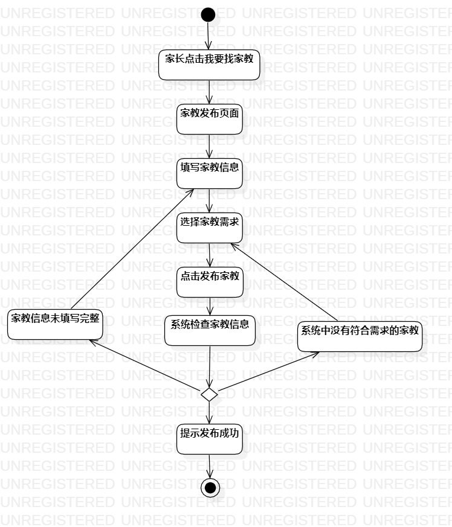

# 实验三：过程建模  

## 一、实验目标
1. 理解活动用例元素；
2. 掌握过程建模方法；
3. 掌握活动图（Activity Diagram）的画法。

## 二、实验内容  
1. 学习过程建模方法；
2. 学习活动图的概念和组成；
3. 学习活动图画法；
4. 根据用例规约画活动图。

## 三、实验步骤  
1. 观看老师视频学习过程建模方法和活动图画法；
2. 根据用例规约画活动图；
3. 将绘制的活动图导出为图片；
4. 编写实验报告。

## 四、实验结果
图1：上传简历的活动图

图1：发布家教信息的活动图

