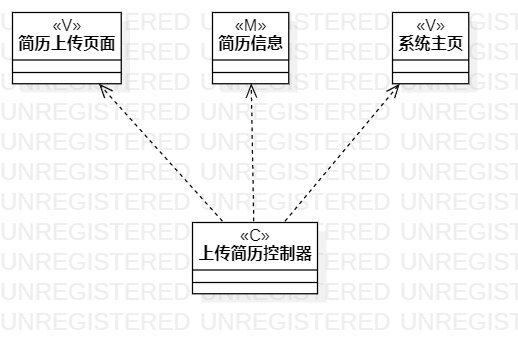
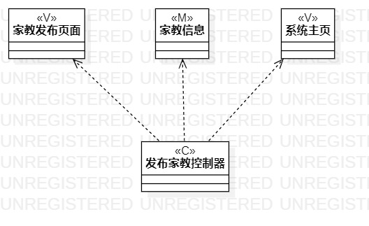

# 实验四五：类建模
## 一、实验目标
1.  掌握类建模方法；
2.  了解MVC或你熟悉的设计模式；
3.  掌握类图的画法；
4.  掌握类的关系。

## 二、实验内容
1. 学习MVC模式设计类；
2. 根据功能设计类的关系；
3. 画出类图。

## 三、实验步骤  
1. 观看老师视频学习类建模和MVC模式；
2. 根据用例规约找出每个用例的类，画出各个类;
3. 根据mvc模式将类划分为模型(M)、视图(V)、控制器(C);
4. 分析功能设计出类之间的关系;
5. 画出类图;
6. 编写实验报告。

## 四、实验结果

图1：上传简历的类图  

  

图2：发布家教信息的类图  

  

