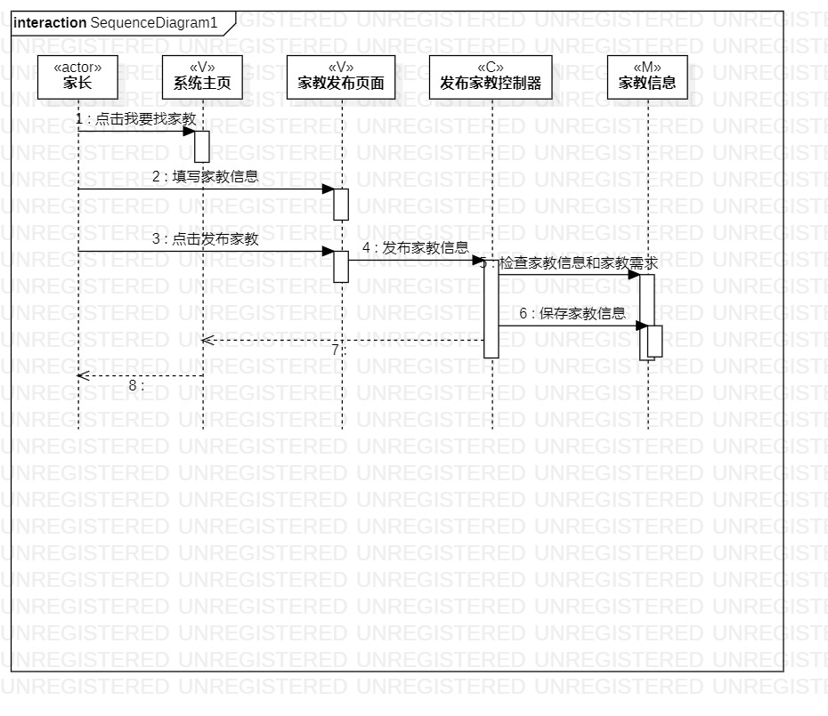

# 实验六：交互建模  
## 一、实验目标
1. 理解系统交互；
2. 掌握UML顺序图的画法；
3. 掌握对象交互的定义与建模方法。

## 二、实验内容
1. 根据用例模型和类模型，确定功能所涉及的系统对象； 
2. 在顺序图上画出参与者（对象）；
3. 在顺序图上画出消息（交互）.

## 三、实验步骤
1. 观看老师视频学习交互建模的概念和顺序图的画法；
2. 根据类图找出n+1个参与者； 
3. 根据用例规约分析消息传递过程；
4. 画出顺序图

## 四、实验结果

图1：上传简历的顺序图

图2：发布家教信息的顺序图 

