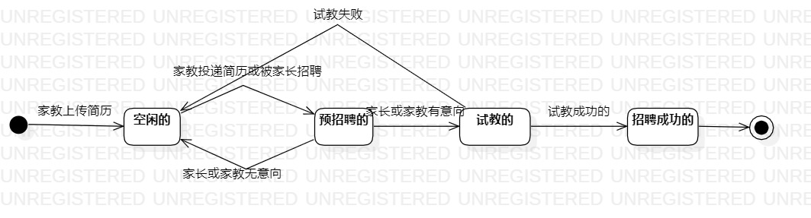

# 实验七：状态建模
## 一、实验目标
1. 掌握对象状态建模（Statechart）；
2. 掌握UML状态图的画法。

## 二、实验内容
1. 寻找一个关键的对象，设计该对象的关键状态；
2. 设计该对象的关键状态；
3. 画出状态图。

## 三、实验步骤
1. 观看老师视频学习对象状态建模；
2. 在系统中找出一个关键的对象；
3. 设计出该对象的关键状态；
4. 设计状态之间的转变条件；
5. 画出状态图。

## 四、状态图

图1：家教的状态图

