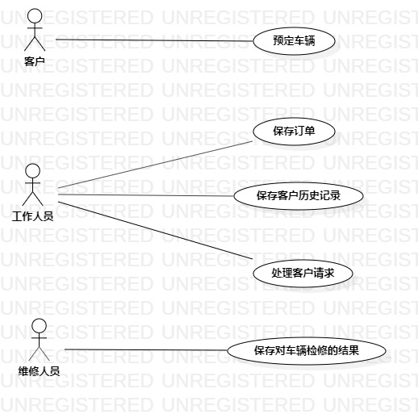

# 实验二：用例建模

## 1.实验目标

- 1.1 了解用例图的概念
- 1.2 掌握用例图的画法
- 1.3 学习用例规约的写法

## 2.实验内容

- 2.1 细化功能需求
- 2.2 画出自己选题的用例图
- 2.3 编写用例规约

## 3.实验步骤

- 3.1 观看教学视频
- 3.2 跟着老师的演示做一遍
- 3.3 动手画自己选题的用例图以及编写用例规约

## 4.实验结果

图1：汽车租赁系统用例图

## 表1：预定车辆用例1规约  

用例编号  | UC01 | 备注  
-|:-|-  
用例名称  | 预定车辆  |   
前置条件  |   公司有空闲汽车   |   
后置条件  |   生成订单  |   
基本流程  | 1.通过手机、网页或者前台填写订单  |   
~| 2.提交订单  |   
~| 3.显示提交订单成功页面  |   
扩展流程  | 2.1 无空闲汽车，显示预定失败页面|    

## 表2：保存订单用例2规约  

用例编号  | UC02 | 备注  
-|:-|-  
用例名称  | 保存订单  |   
前置条件  |   用户成功提交订单   |   
后置条件  |      |   
基本流程  | 1.签订租赁协议  |   
~| 2.付款  |   
~| 3.提供车辆钥匙  |   
扩展流程  | 2.1 租赁协议填写有误，提示更改并重新填写  |    

## 表3：保存客户历史记录用例3规约  

用例编号  | UC03 | 备注  
-|:-|-  
用例名称  | 保存客户历史记录  |   
前置条件  |   车辆检修完毕  |   
后置条件  |      |  
基本流程  | 1.填写用户租还车时间  |   
~| 2.填写维修人员对车辆检修结果  | 
~| 3.填写客户信息  | 
~| 4.保存客户历史记录  | 

## 表4：处理客户请求用例4规约  

用例编号  | UC04 | 备注  
-|:-|-  
用例名称  | 处理客户请求  |   
前置条件  |   客户开始使用车辆   |    
后置条件  |    客户归还车辆  | 
基本流程  | 1.更换车辆  |   
~| 2.延长车辆使用期限  |   
~| 3.提前归还车辆   |   
扩展流程  | 2.1 更换车辆失败，提示无其他可用车辆   |   
~| 2.2 延长车辆使用期限失败，提示该车辆已被其他用户预约  |  

## 表5：保存对车辆检修的结果用例5规约  

用例编号  | UC05 | 备注  
-|:-|-  
用例名称  | 保存对车辆检修的结果  |   
前置条件  | 客户归还车辆  |    
后置条件  |   保存客户历史记录  | 
基本流程  | 1.检查车辆是否损坏 |
~| 2.清洁车辆  |   
~| 3.提交车辆检修结果  |   
扩展流程  | 2.1 车辆损坏，提交损坏信息  |  
