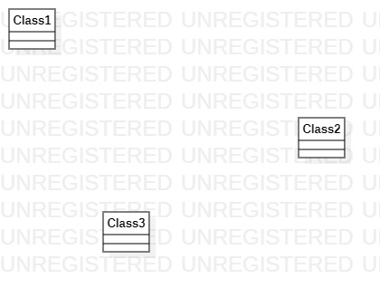

# 实验1

## 实验目标

1.熟悉GitHub实验过程
2.安装与使用StarUML

## 实验内容

1.安装GitHub并练习使用Git Bash
2.安装StarUML并创建一个图

## 实验步骤
1.下载StarUML和 Git
2.注册git账号
3.确认选题及功能要求
4.建立第一个UML模型图
5.使用git上传本地使用文件
6.在GitHup将git上的文件发送至老师账号

## 实验结果

1.画图

  
图1.第一个StarUML

2.选题标题：汽车租赁系统
功能
1.通过几种不同的方式预定车辆
2.保存客户的预定单
3.保存客户的历史记录
4.工作人员可以处理客户申请
5.维修人员可以保存对车辆检修的结果

