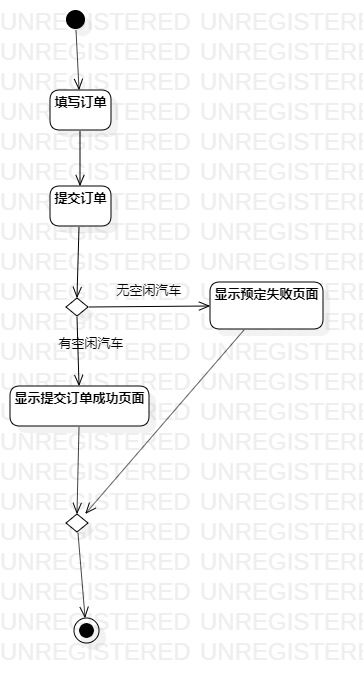
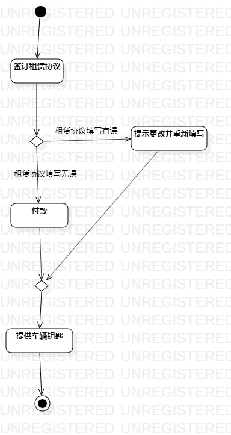
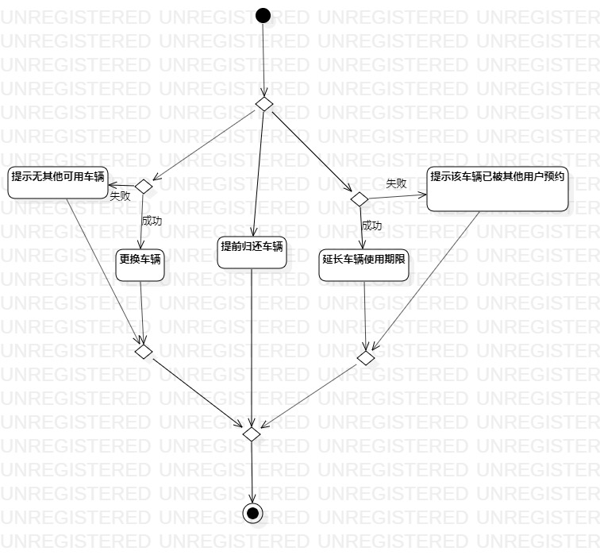
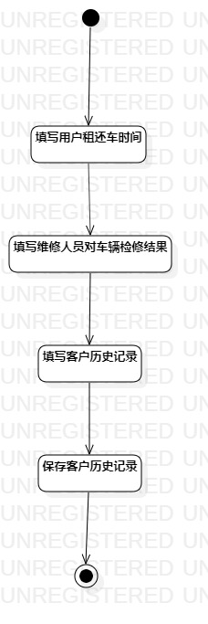
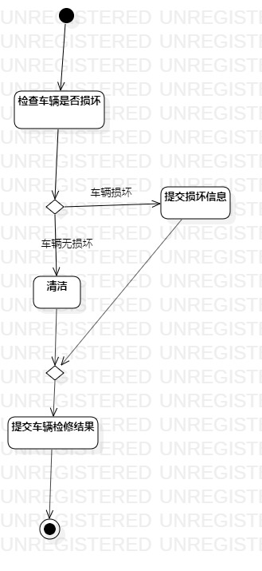

# 实验三：过程建模

## 1.实验目标
 - (1).掌握过程建模的方法
 - (2).掌握活动图的画法
## 2.实验内容
 - (1).观看过程建模视频
 - (2).回顾实验二用例建模的过程
 - (3).根据实验二的用例规约画出活动图

## 3.实验步骤
 - (1).观看实验三的讲解视频和讲义
 - (2).按照用例规约画活动图

## 4.实验结果

图1：预定车辆活动图

图2：保存订单活动图

图3：处理客户请求活动图

图4：保存客户历史记录活动图

图5：保存对车辆检修结果活动图
