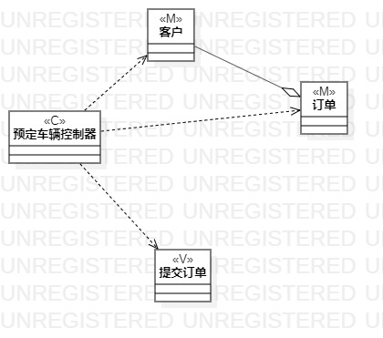
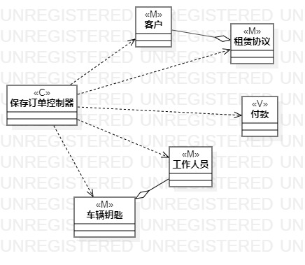
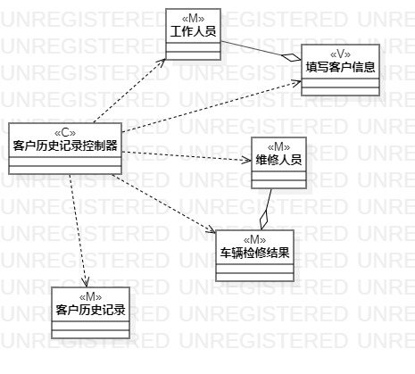
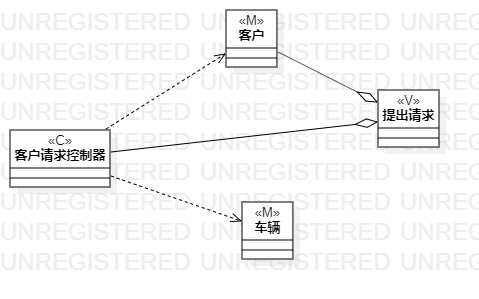
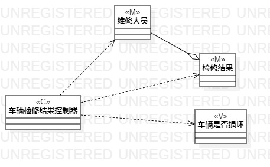

# 实验4、5
## 1.实验目标    
- (1)掌握l类建模方法 
- (2)了解MVC或你熟悉的设计模式  
- (3)掌握类图的画法

## 2.实验内容
- (1)基于MVC模式设计类
- (2)设计类的关系  
- (3)画出类图  

## 3.实验步骤  
- (1)观看教学视频
- (2)根据自己的规约找到相应的类
- (3)查看实验要求
- (4)对照自己的规约着手画类图

## 4.实验结果

类图1

类图2

类图3

类图4

类图5
