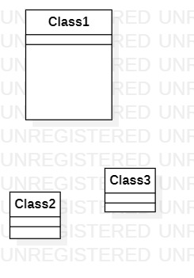

# 实验1

## 1.实验目标

1.熟悉GitHub实验过程
2.安装与使用StarUML

## 2.实验内容

1.安装GitHub并练习使用Git Bash
2.安装StarUMl并创建一个图

## 3.实验步骤

1.在GitHub的发布中发布自己的建模选题：#484 Switch实体游戏卡带交易系统  
2.找出建模选题中的用例和参与者  
3.在StarUML中画用例图  
4.使用Markdown编写实验报告  

## 4.实验结果

1.画图

  
图1.在一个StarUML上创建的第一个图
