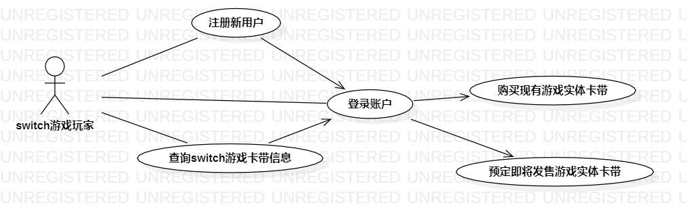

# 实验二 用例建模

## 一.实验目标

 1. 使用MarkDown编写报告
 2. 了解并掌握用例图的画法

## 二.实验内容

 1. 选题
 2. 用starUML画出建模用例
 3. 编写实验二报告

## 三.实验步骤
 
1. 确定选题 
 
  Switch实体游戏卡带交易系统  功能：
  - 搜索Switch实体游戏卡带
  - 购买Switch实体游戏卡带
 
2. 根据自己选题的功能画图
  - 添加Actor：Switch游戏玩家
  - 添加UseCase：搜索Switch实体游戏卡带、购买Switch实体游戏卡带
  - 建立Actor与UseCase联系
3. 编写用例规范
 

## 四.实验结果

## 表1：搜索Switch实体游戏卡带用例规约  

用例编号  | UC01 | 备注  
-|:-|-  
用例名称  | 搜索Switch实体游戏卡带  |   
前置条件  |      | *可选*   
后置条件  |      | *可选*   
基本流程  | 1. Switch游戏玩家点击搜索；  |*用例执行成功的步骤*  
~| 2. 系统显示搜索页面；  |  
~| 3. 玩家输入游戏卡带名称；  |  
~| 4. 系统查询到Switch实体游戏卡带信息，显示卡带信息；  |   
~| 5. 玩家进入该游戏卡带信息界面；   |   
~| 6. 系统显示该游戏卡带已公布的游戏pv、实体演示、玩家测评、价格及发售日期；   |   
扩展流程  | 4.1 系统查询发现该Switch卡带不存在，返回搜索界面，提示输入的信息有误请重新输入  |*用例执行失败*    

## 表2：购买Switch实体游戏卡带用例规约  

用例编号  | UC02 | 备注  
-|:-|-  
用例名称  | 购买Switch实体游戏卡带  |   
前置条件  |  Switch游戏玩家登陆成功    | *可选*   
后置条件  |  返回游戏信息界面    | *可选*   
基本流程  | 1. Switch游戏玩家在该游戏卡带信息界面点击购买；  |*用例执行成功的步骤*    
~| 2. 系统根据该卡带的发售情况显示购买Switch卡带的界面或预定Switch卡带的界面；  |   
~| 3. 玩家点击确认购买后填写个人信息并提交；   |   
~| 4. 系统保存玩家信息后显示支付界面并提供支付方式；   |   
~| 5. 玩家自选支付方式支付；   |  
~| 6. 系统检测到玩家扣费成功后提示支付成功并提供订单信息。   |  
扩展流程  | 6.1 系统检测到玩家未成功扣费，系统返回游戏信息界面，并提示支付失败  |*用例执行失败*
