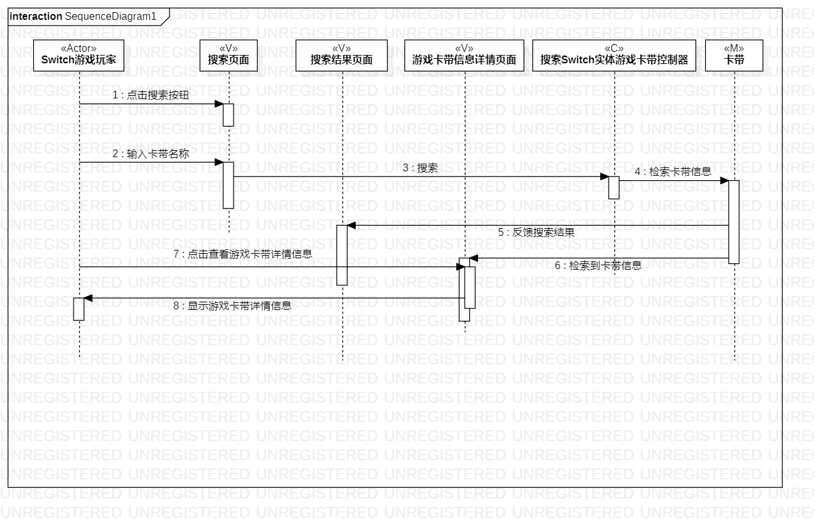
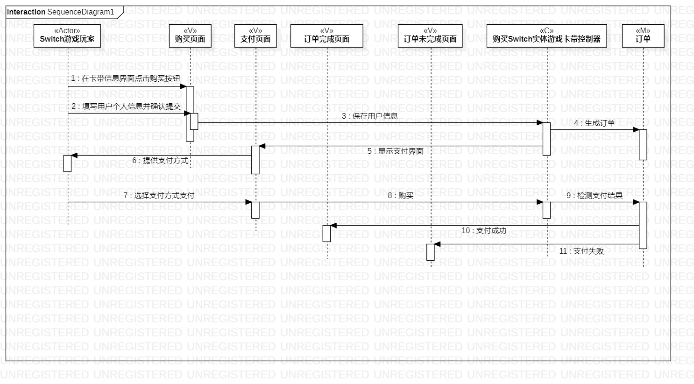

## 实验六：交互建模

#### 一、实验目标

1、理解系统交互的概念。

2、掌握UML顺序图的画法。

3、掌握对象交互的定义与建模方法。

#### 二、实验内容

1、根据用例图和类图确定功能涉及的对象和消息。

2、在顺序图中画出参与对象。

3、在顺序图中画出消息。

#### 三、实验步骤

1、了解顺序图中的对象、消息的概念和画法。

2、根据用例图和类图确定对象，创建顺序图。

3、根据用例图和类图，在顺序图中画出对象。

4、根据用例图和类图，在顺序图中画出消息。

#### 四、实验结果

1、搜索Switch实体游戏卡带交互建模

2、购买Switch实体游戏卡带交互建模

