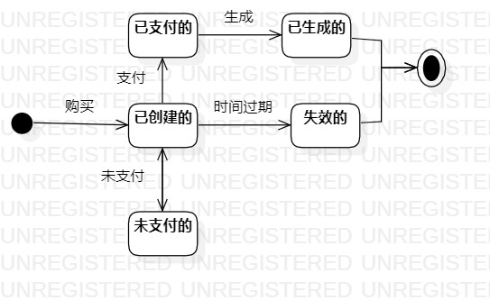

# 实验七：状态建模

## 一、实验目标

1. 掌握状态图及其画法（状态图，Statechart）

## 二、实验内容

1. 学习并理解状态图的定义；
2. 寻找1个重要的对象；
3. 寻找这个对象的所有关键状态；
4. 画出状态之间的转换条件；
5. 画状态图。

## 三、实验步骤

1. 修改实验6

2. 寻找关键对象-Switch实体游戏卡带订单；

3. 设计Switch实体游戏卡带订单的状态：已创建的、已支付的、未支付的、已生成的、失效的

4. 绘制实验预定状态图

## 四、实验结果

1、Switch实体游戏卡带订单状态图

