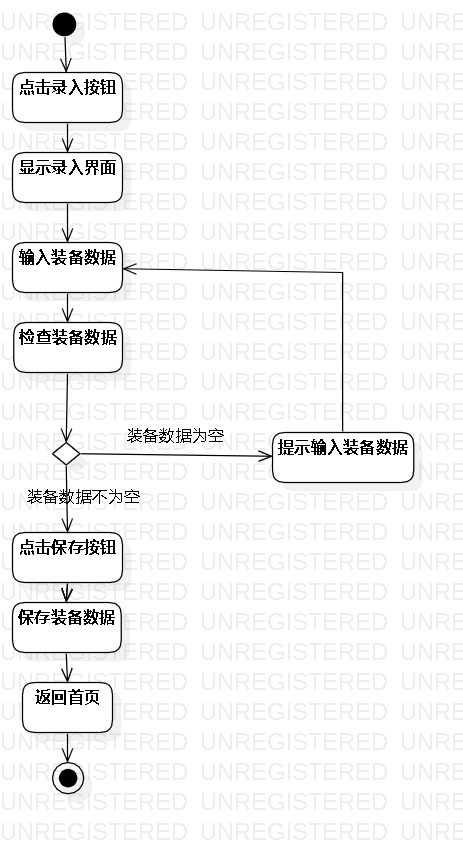
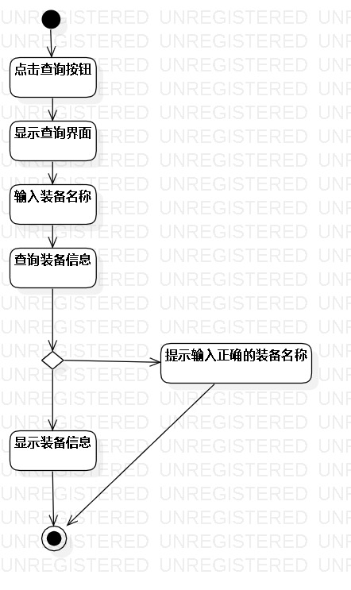
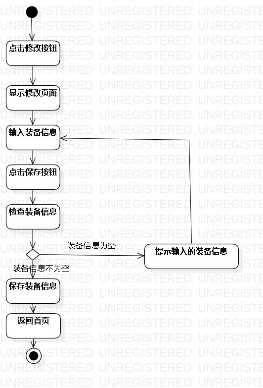

# 实验三：用例建模

## 1.实验目的
1. 掌握过程建模方法
2. 掌握活动图的画法。（Activity Diagram）

## 2.实验内容
1. 把基本流程和扩展流程的动作画为操作（Action）
2. 在出现分支的操作之后使用决策（Decision）节点。

## 3.实验步骤
1. 选择初始结点Initial和结束结点Final
2. 根据用例规约中的基本流程和扩展流程添加操作Action
3. 在分支操作处添加决策结点Decision，标明判决条件
4. 按流程连接各个元素

## 4.实验结果

图1：录入装备活动图

图2：查询装备信息活动图

图3：购买装备活动图
