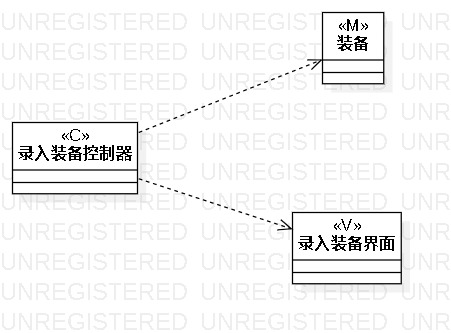
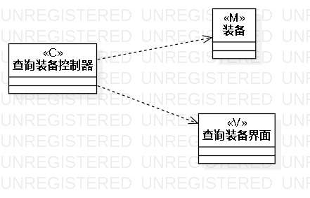
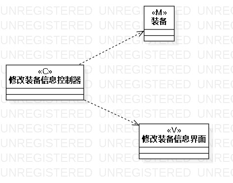

# 实验四：类建模

## 1.实验目标
1. 掌握类建模方法；
2. 了解MVC或你熟悉的设计模式；
3. 掌握类图的画法。（Class Diagram）

## 2.实验步骤
1. 根据用例规约来确定每个用例的类   
   录入装备：录入装备控制器(C),装备(M),录入装备界面(V)  
   查询装备：查询装备控制器(C),装备(M),查询装备界面(V)  
   修改装备信息：购买装备控制器(C),装备(M),购买装备界面(V)   
2. 根据类之间的关系用正确的连线连接起来

## 3.画图要点
1. 从用例规约中的基本流程和扩展流程中寻找类；
2. 给系统操作设计业务服务类。
3. 有多少个用例，画多少个类图

## 4.实验结果

图1：录入装备类图

图2：查找装备类图

图3：购买装备类图
