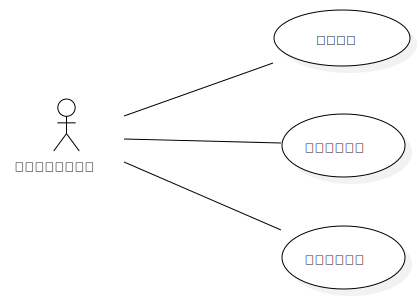

# 实验二 用例建模

## 实验目标
  ### 1.学会使用Markdown编写实验报告  
  ### 2.掌握用例的概念和用例建模
  
## 实验内容
  ### 1.提交个人选题到Issues  
  ### 2.用Markdown完成实验报告  
  ### 3.用StartUML完成用例建模
## 实验步骤  
 ### 1. 选题为眼睛健康助手系统
 ### 2. 根据issues在StarUML上创建用例图（
 ### 3. 确定参与者（Actor）:  
      - 眼睛健康助手用户
 ### 4. 确定用例（UserCase）:   
       - 色盲检测
       - 粗略测试近视等级
       - 记录用眼时间且每一小时提醒休息
 ### 5. 建立Actor和UserCase之间的联系
 ### 6. 绘画用例图
 ### 7. 编写用例规约
  
  ## 实验结果
    
  图一：”眼睛健康助手系统“用例图
  
  
  ## 表1：色盲检测用例规约  

用例编号  | UC01 | 备注  
-|:-|-  
用例名称  | 色盲检测  |   
前置条件  |  进入眼睛健康助手 | *可选*   
后置条件  |    | *可选*   
基本流程  | 1. 眼睛健康助手用户点击进入色盲检测功能；  |*用例执行成功的步骤*    
~| 2. 系统显示各种颜色卡片；  |   
~| 3. 眼睛健康助手用户判断卡片信息；  |   
~| 4. 系统根据用户的判断是否正确  |   
~| 5. 系统显示结果，用户是否为色盲。  |  
扩展流程  | 4.1 系统检查卡片没有改变，提醒用户重新启动功能”。  |*用例执行失败* 

## 表2：测试近视等级用例规约  

用例编号  | UC02 | 备注  
-|:-|-  
用例名称  | 测试近视等级 |   
前置条件  |  进入眼睛健康助手   | *可选*   
后置条件  |    | *可选*   
基本流程  | 1. 眼睛健康助手用户点击进入近视等级测试；  |*用例执行成功的步骤*    
~| 2. 系统显示各种大小不同的图片；  |   
~| 3. 眼睛健康助手用户根据看到的图片来选择清晰，模糊，看不见；  |   
~| 4. 系统根据用户的选择来粗略判断使用者近视等级 （视力健康 1级 、视力一般 2级、视力严重 3级） |   
~| 5. 系统显示用户近视等级 |  
扩展流程  | 4.1 系统检查图片没有改变，提醒用户重新启动功能”。  |*用例执行失败* 

## 表3：记录用眼时间用例规约  

用例编号  | UC03 | 备注  
-|:-|-  
用例名称  | 用眼时间  |   
前置条件  |  进入眼睛健康助手   | *可选*   
后置条件  |     | *可选*   
基本流程  | 1. 眼睛健康助手用户点击进入用眼时间功能；  |*用例执行成功的步骤*  
~| 2. 眼睛健康助手用户点击开始记录用眼时间  | 
~| 3. 系统显示眼睛健康助手从启动功能到现在的时间；（每次关闭会重新记录用眼时间）  |   
~| 4. 当时间每过60分钟就会弹窗提醒用户注意用眼时间  |  
~| 5. 眼睛健康助手用户点击关闭记录用眼时间  | 
扩展流程  | 4.1 系统检查时间没有改变，提醒用户重新启动功能”。  |*用例执行失败* 
