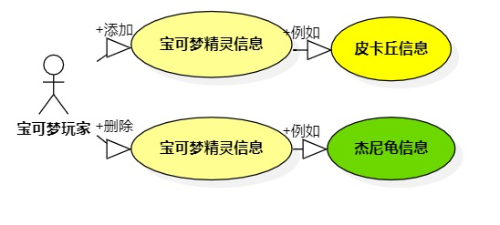

# 实验二 用例建模

## 实验目标
  ### 1.学会使用Markdown编写实验报告  
  ### 2.掌握用例的概念和用例建模
  
## 实验内容
  ### 1.提交个人选题到Issues（https://github.com/hzuapps/uml-modeling-2020/issues/984）  
  ### 2.用Markdown完成实验报告  
  ### 3.用StartUML完成用例建模
## 实验步骤  
 ### 1. 选题为宝可梦精灵信息管理系统 
 ### 2. 根据issues在StarUML上创建用例图（
 ### 3. 确定参与者（Actor）:  
      - 宝可梦玩家
 ### 4. 确定用例（UserCase）:   
       -1、添加宝可梦精灵信息
       -2、删除宝可梦精灵信息
 ### 5. 建立Actor和UserCase之间的联系
 ### 6. 绘画用例图
 ### 7. 编写用例规约
  
  ## 实验结果
    
  图一：”宝可梦精灵信息管理系统“用例图
  
  
  ## 表1：添加宝可梦精灵信息用例规约  

用例编号  | UC01 | 备注  
-|:-|-  
用例名称  | 添加宝可梦精灵信息  |   
前置条件  |   显示添加宝可梦页面| *可选*   
后置条件  |   系统回到添加宝可梦页面 | *可选*   
基本流程  | 1.宝可梦玩家输入属性信息和编号，点击添加按钮 ；  |    *用例执行成功的步骤*
~| 2.系统检查无该宝可梦信息，添加宝可梦信息，提示添加成功 ；  |    
扩展流程  | 2.1 系统检查该宝可梦信息不存在，提示添加失败，系统回到功能选择页面 |*用例执行失败* 

## 表2：删除宝可梦精灵信息用例规约  

用例编号  | UC02 | 备注  
-|:-|-  
用例名称  | 删除宝可梦精灵信息 |   
前置条件  |   显示删除宝可梦页面| *可选*   
后置条件  |   系统回到功能选择页面 | *可选*   
基本流程  | 1.宝可梦玩家输入宝可梦名字或编号，点击查询；  |*用例执行成功的步骤*    
~| 2.系统显示要删除的宝可梦信息，点击删除按钮；  |   
~| 3. 系统检查宝可梦信息存在，删除该宝可梦信息，提示删除成功。|     
扩展流程  | 3.1 系统检查宝可梦信息不存在，提示无法删除，系统回到功能选择页面 |*用例执行失败*    

