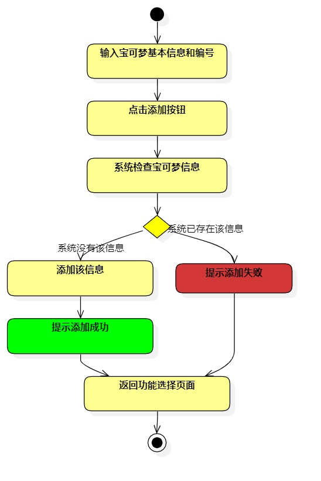
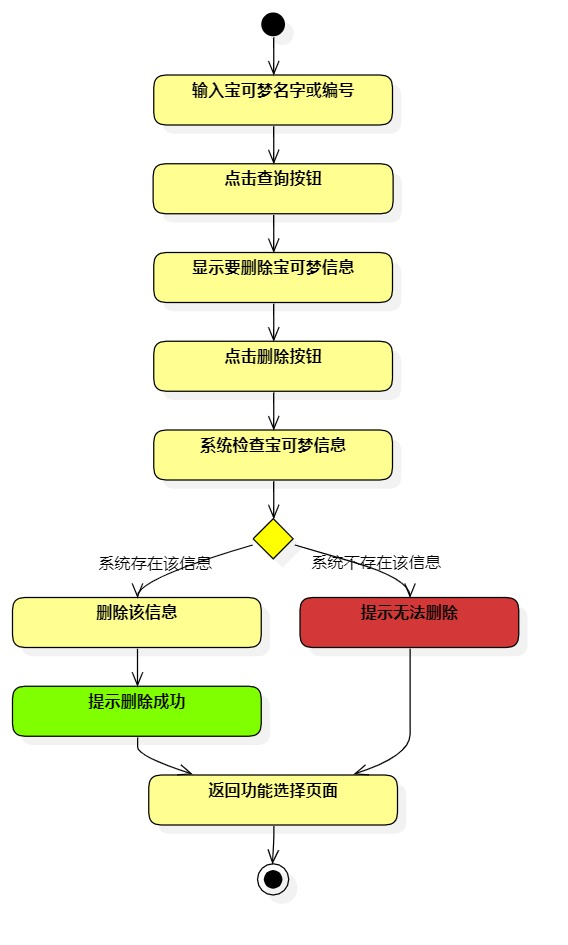

# 实验三：过程建模
## 一、实验目标

1. 掌握过程建模方法；
2. 掌握活动图的画法。（Activity Diagram）

## 二、实验内容

1. 学习活动图画法，
2. 根据用例规约用StarUML画活动图

## 三、实验步骤

1. 用StarUML画添加宝可梦精灵信息的活动图

  - 首先先添加开始initial和结束final
  - 其次根据用例规约添加相应的action
  - 如果有扩展流程，添加decision
  - 添加一个Merge将分支汇总
  - 用control flow连接各个部分
  - 最后调整图片位置及大小，让图片整洁

2. 用StarUML画删除宝可梦精灵信息的活动图(同1)

## 四、实验结果

  
图1：添加宝可梦精灵信息活动图

  
图2：删除宝可梦精灵信息活动图
