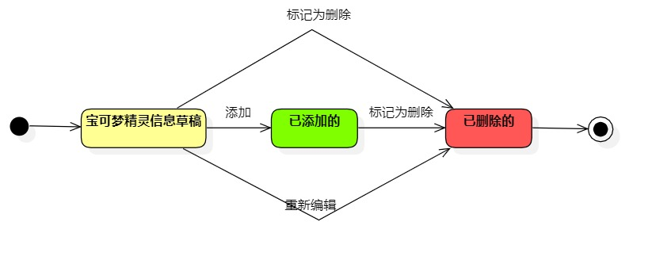

# 实验七 状态建模

## 一、实验目标

1. 理解何为对象的状态；
2. 掌握状态建模方法；
3. 掌握状态图的画法(Statechart Diagram)。

## 二、实验内容

1. 学习对象的状态的概念；
2. 学习状态图的画法；
3. 找出自己系统中的一个关键对象，绘制该对象的状态图。 

## 三、实验步骤

1. 从本系统中找出一个关键的对象，即宝可梦精灵  
2. 设置宝可梦精灵信息的状态，为草稿、已添加的、已删除的  
3. 设置这三种状态转变的条件  
4. 完成该状态图

## 四、实验结果

  
图一.宝可梦精灵的状态图
