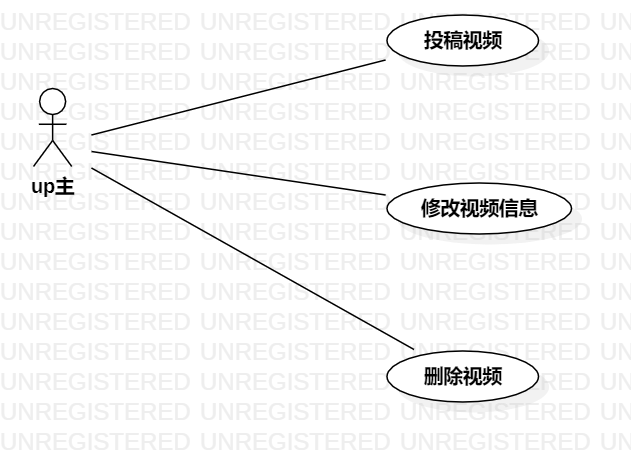

# 实验二 用例建模

##  1、实验目标

1、选题 #693  
2、做出自己选题的UML的use case

##  2、实验内容

1、细化功能需求。      
2、画出用例图（Use Case Diagram）。      
3、编写用例规约（表格）    

##  3、实验步骤

1、选好题  
2、分析有什么人使用该系统和操作  
3、根据分出来的结果画图  
4、编写用例规约

##  4、实验结果

图1 B站视频管理系统用例图

# 用例规约的编写

## 表1：投稿视频用例1规约  

用例编号  | UC01 | 备注  
-|:-|-  
用例名称  | 投稿视频  |   
前置条件  | up主进入投稿页面 | *可选*   
后置条件  |     | *可选*   
基本流程  | 1.up主上传视频，填写标题，点击投稿按钮  |*用例执行成功的步骤*    
~| 2.系统检查到视频上传成功，显示上传成功  |   
~| 3. up主点击投稿  |   
~| 4.系统检查到标题符合规定并显示投稿成功   |   
扩展流程  | 1.1系统无法识别上传的视频   |*用例执行失败*    
~| 4.1系统识别视频标题不符合规定   |  

## 表2：修改视频信息用例1规约  

用例编号  | UC02 | 备注  
-|:-|-  
用例名称  | 修改视频信息  |   
前置条件  | up主进入视频管理页面 | *可选*   
后置条件  |     | *可选*   
基本流程  | 1.up主点击视频下的修改按钮  |*用例执行成功的步骤*    
~| 2.系统查询该视频的相关信息并显示出可修改的信息  |   
~| 3. up主修改视频相关信息并点击提交按钮  |   
~| 4.系统检查所修改信息符合规定并显示修改成功  |   
扩展流程  | 4.1系统检查所修改信息不符合规定并显示修改失败   |*用例执行失败*    
~|   |  

## 表1：删除视频用例1规约  

用例编号  | UC03 | 备注  
-|:-|-  
用例名称  | 删除视频  |   
前置条件  | up主进入视频管理页面 | *可选*   
后置条件  |     | *可选*   
基本流程  | 1.up主点击视频下的删除按钮  |*用例执行成功的步骤*    
~| 2.系统检查到该视频相关信息并删除，显示删除成功  |    
扩展流程  | 2.1系统检查不到视频相关信息，显示删除失败   |*用例执行失败*    
