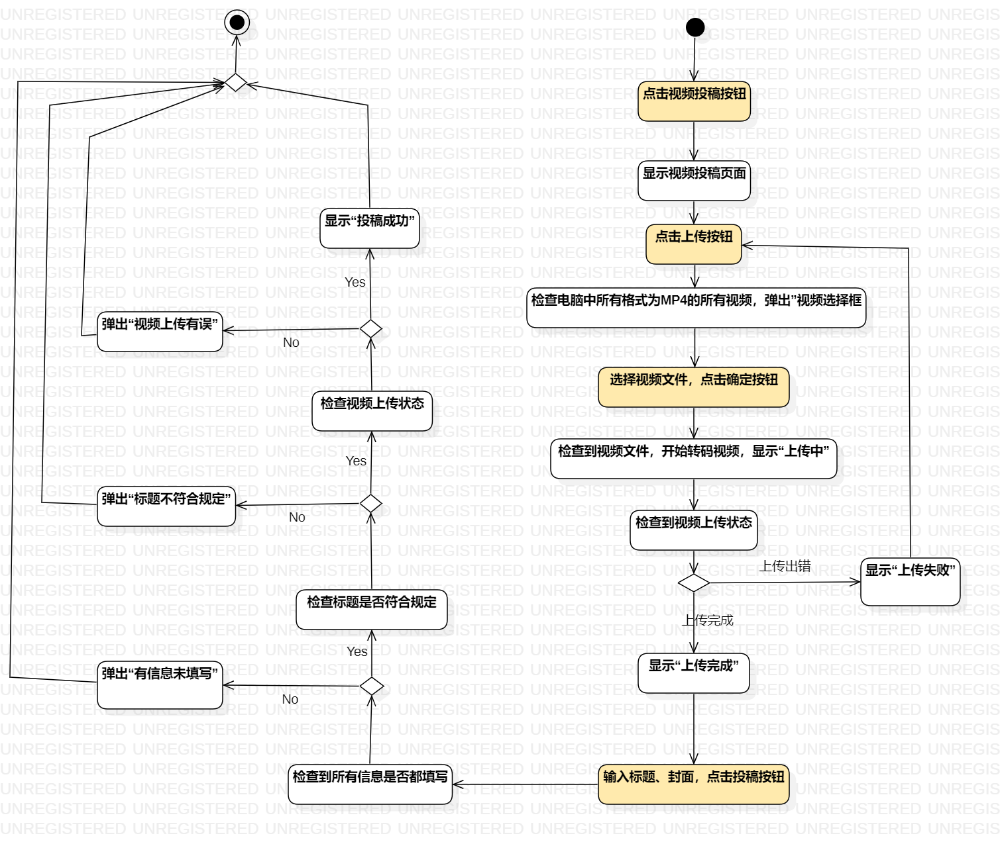
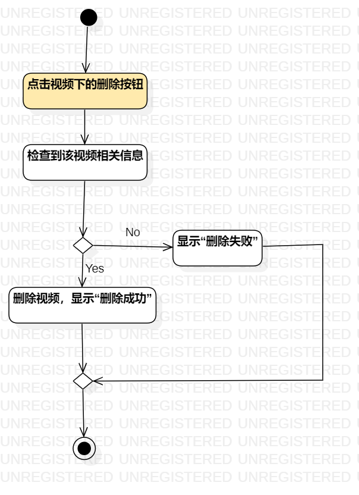
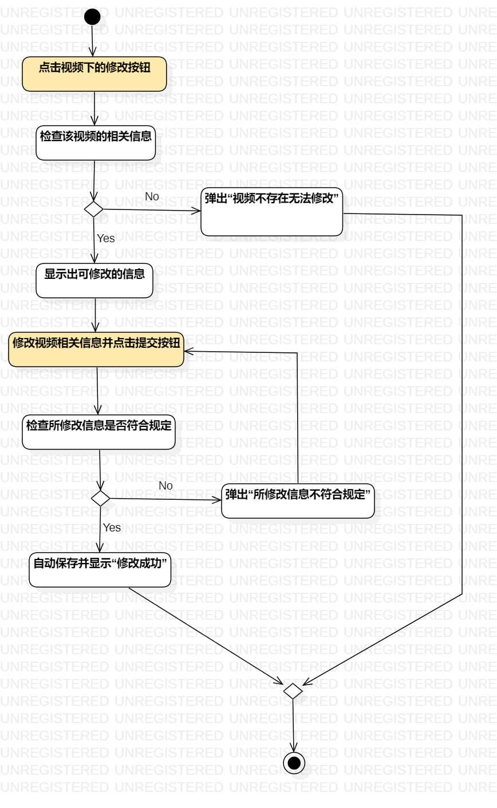

## 实验三 过程建模

##  1、实验目标

1、掌握过程建模方法；  
2、掌握活动图的画法。（Activity Diagram）  

##  2、实验内容

1、根据用例规约画出活动图        

##  3、实验步骤

1、学习教学视频  
2、画活动图  

##  4、实验结果

  
图1：投稿视频活动图

  
  
图2：删除视频用活动图

  
图3：修改视频信息活动图
