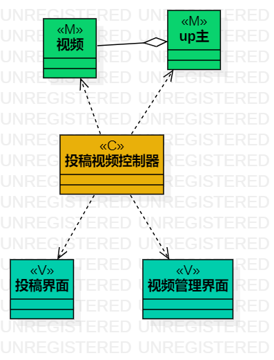

# 实验四&五 :类建模

## 一、实验目的

## 1、掌握类建模方法；  
## 2、了解MVC或你熟悉的设计模式；  
## 3、掌握类图的画法。（Class Diagram）  

## 二、实验内容

## 1、基于MVC模式设计类；    
## 2、设计类的关系 ；  
## 3、画出类图  。  

## 三、实验步骤

## 1、观看B站视频  
## 2、根据用例规约画出类图  

## 实验结果

  
图1：投稿视频类图

  
  
图2：删除视频类图

  
图3：修改视频信息类图
