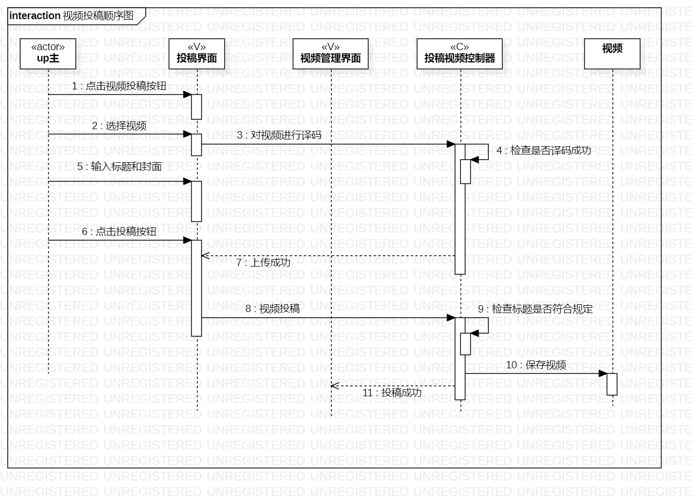
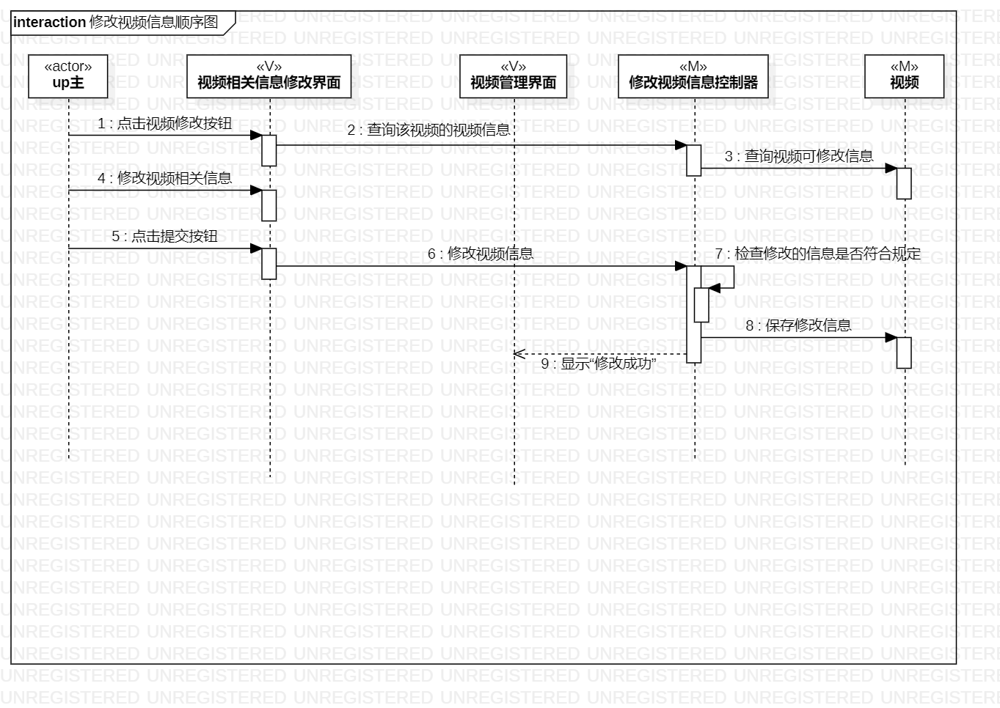
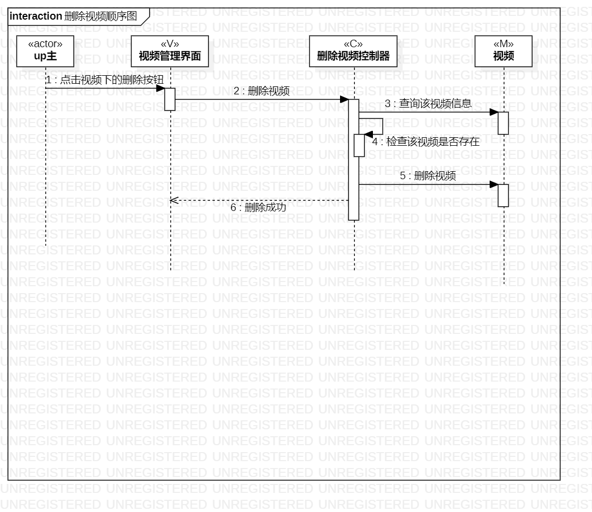

# 实验六 顺序图

## 一、实验目标

1. 理解系统交互；
2. 掌握UML顺序图的画法；
3. 掌握对象交互的定义与建模方法。

## 二、实验内容

1. 根据活动图和类图画出顺序图  

## 三、实验步骤

1. 在B站学习顺序图的概念和画法  
2. 观察别人的案例和自己的理解  
3. 画出顺序图  

## 四、实验结果

图1.视频投稿顺序图

图2.修改视频顺序图

图3.删除视频顺序图
