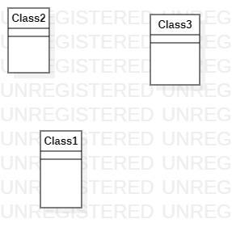

# 实验一(UML建模工具)

## 实验目标
 + 工具安装之后，打开并截图，保存在实验报告中；
 + 将个人选题及描述写在实验报告中，具体要求：
 + 选题标题为软件名称；
 + 描述中写出2-3个功能需求（不允许写“注册”和“登录”）；
 + 选题功能应该包含数据库的使用。
 + 实验报告将按照『教学助理』小程序的要求提交（此步骤延后）。

## 实验内容
+ 下载并安装建模工具 StarUML，下载地址：http://staruml.io
+ 确定个人建模选题，将选题填写在 Issues 中：
https://github.com/hzuapps/uml-modeling-2020/issues

## 实验结果
1. 使用StarUML画图
    

2. 选题：匿名聊天
    功能需求：
    + 用户可以创建新的聊天室
    + 用户可以在已经存在的聊天室聊天
    + 用户可以订阅聊天室/查看发过言的聊天室
    + 管理员可以删除/隐藏聊天室