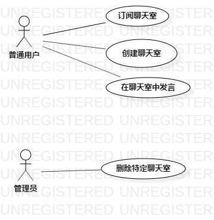

# 实验二：用例建模

## 实验目标
 + 细化功能需求。
 + 画出用例图

## 实验内容
+ 选题为匿名聊天论坛
    功能：
    + 聊天室用户创建聊天室
    + 聊天室用户可以在任意聊天室发言
    + 管理员可以删除任意聊天室
+ 参与者
    + 管理员
    + 聊天室用户
+ 确定用例
    + 创建聊天室
    + 删除聊天室
    + 在聊天室中发言
+ 编写用例规约

## 实验结果

图一：匿名聊天室用例图

### 表一：创建聊天室用例规约

用例编号 | UC01 | 备注
-|:-|-
用例名称|创建聊天室|
前置条件| 聊天室用户进入匿名聊天软件系统 |
后置条件| 系统产生新的可以被所有聊天室用户所阅览使用的聊天室 | 
基本流程| 1. 聊天室用户点击创建新的聊天室按钮; |
~| 2. 系统加载页面资源，显示发言界面; |
~| 3. 填写任意该聊天室想要主题内容，点击发送按钮; |
~| 4. 系统检测发送内容是否有敏感词且内容是否为空或内容过长；|
~| 5. 后台会创建一个新的聊天室页面，所有登陆用户都可在此聊天室发言，并可以看到所有该聊天室中出现的发言内容；|
扩展流程| 5.1 系统检测发现该内容相关信息不合法; |*用例执行失败*

### 表二：在聊天室中发言用例规约

用例编号 | UC03 | 备注
-|:-|-
用例名称|在已创建的聊天室发言|
前置条件| 聊天室用户登录进入匿名聊天系统 |
后置条件| 聊天室中出现所写内容 | 
基本流程| 1. 聊天室用户进入想要发言的聊天室; |
~| 2. 聊天室用户点击聊天室功能栏中的发言按钮; |
~| 3. 系统加载页面资源，显示发言界面; |
~| 4. 填写任意内容，完成后点击发送按钮；|
~| 5. 系统检测发送内容是否有敏感词且是否为空，如无敏感词也不为空；|
~| 6. 则该发送信息将出现在该聊天室中，所有登陆普通用户都可查看；|
扩展流程| 6.1 系统检测发现该内容信息不合法; |*用例执行失败*

### 表三：删除聊天室用例规约

用例编号 | UC04 | 备注
-|:-|-
用例名称|删除已创建的聊天室|
前置条件| 管理员进入后台管理页面 |
后置条件| 聊天室被删除 | 
基本流程| 1. 管理员进入想要删除的聊天室; |
~| 2. 播放器用户点击聊天室功能栏中的删除该聊天室按钮; |
~| 3. 系统检测该聊天室信息；|
~| 4. 该聊天室被隐藏，不再可被普通用户阅览；|
拓展流程|3.1 系统检测发现该聊天室信息失效；|*用例执行失败*