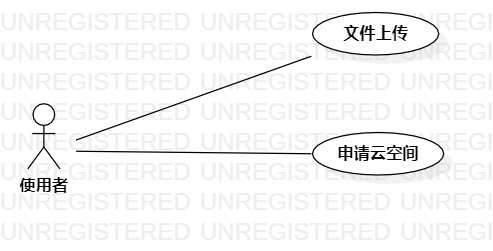

# 实验二：用例建模

## 1.实验目标 
1.掌握用例图的画法；  
2.学习用例规约的写法。
## 2.实验内容
1.确定选题  
2.画出用例图（Use Case Diagram）。  
3.编写用例规约（表格）。
## 3.实验步骤  
1.系统的功能：  
①使用者可以实现文件上传  
②使用者可以申请云空间    
2.编写出系统的参与角色：使用者  
3.编写出系统使用的用例：  
①文件上传  
②申请云空间    
4.编写用例规约
## 4.实验结果
  
图一：云服务空间申请系统的用例图
### 表一：申请云空间用例规约
用例编号 | UC01 | 备注
-|:-|-
用例名称|申请云空间|
前置条件| 使用者注册账号登录之后 |
后置条件| 使用者得到一定容量的云空间 | 
基本流程| 1. 使用者填写空间大小，点击“云空间的申请”按钮； |
~| 2. 系统查询剩下的云空间的大小和查询使用者允许的最大空间的大小，减去使用者申请的空间大小，返回成功的状态码； |
~| 3. 使用者收到状态码，点击确认申请的云空间； |
~| 4. 系统收到使用者的确认，系统检测确认信号并保存云空间存储状态 |
~| 5. 使用者页面显示“申请成功”。|
扩展流程| 2.1 使用者申请的空间大小超过可以申请的最大空间，提示“超过可以申请的最大空间”|*用例执行失败*
~|2.2 云空间不足，无法分配给使用者，提示“云空间不足”|*用例执行失败*
### 表二：文件上传用例规约

用例编号 | UC02 | 备注
-|:-|-
用例名称|文件上传|
前置条件| 使用者申请云空间成功之后 |
后置条件| 使用者得到成功的状态信息 | 
基本流程| 1.使用者选择文件，点击“文件上传”按钮 ; |
~| 2. 系统检查文件的字节流数据是合法的，将其保存后返回成功状态; |
~| 3. 使用者收到成功状态，显示上传完成。 |
扩展流程| 2.1 系统检测到文件数据不合法，提示“文件数据不合法” |*用例执行失败*
