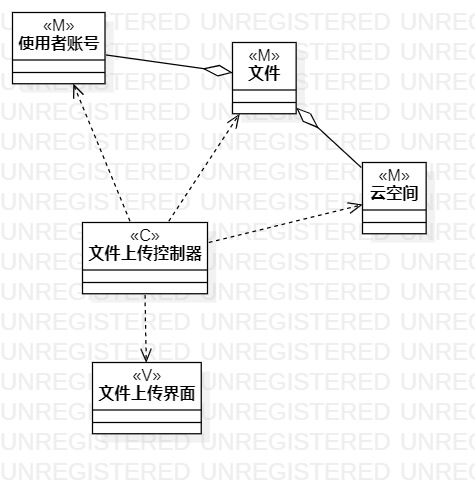
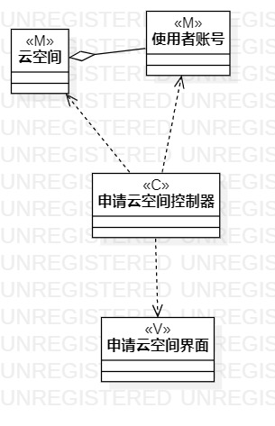

# 实验四-五:类建模(高级类建模)

## 实验目标
  - 掌握类（高级类）建模方法，了解MVC设计模式； 
  - 掌握类图的画法； 
  - 理解类的5种关系； 
  - 掌握类之间关系的画法； 
## 实验内容
  - 基于MVC模式设计出用例当中的Model，View，Controller； 
  - 理解MVC当中的依赖关系； 
  - 画出类图； 
## 实验步骤
### 1.文件上传类图
    1.1 绘制文件上传页面类图，文件上传控制器类图，绘制文件和使用者账号以及云空间类图，
    1.2 文件上传控制器类图与其他给类图之间用依赖线连接；文件类类图与使用者账号类图以及云空间类图间用聚合线连接
### 2. 云空间申请类图
    2.1 绘制云空间申请页面类图，云空间申请控制器类图，云空间管理员类图、云空间文件列表类图和使用者账号类图以及云空间类图
    2.2 云空间申请控制器类图与其他类图之间使用依赖线连接；云空间类图与使用者账号类图、云空间管理员以及云文件列表类图用聚合线连接
### 实验结果

#### 文件上传类图
 
#### 云空间上传类图

